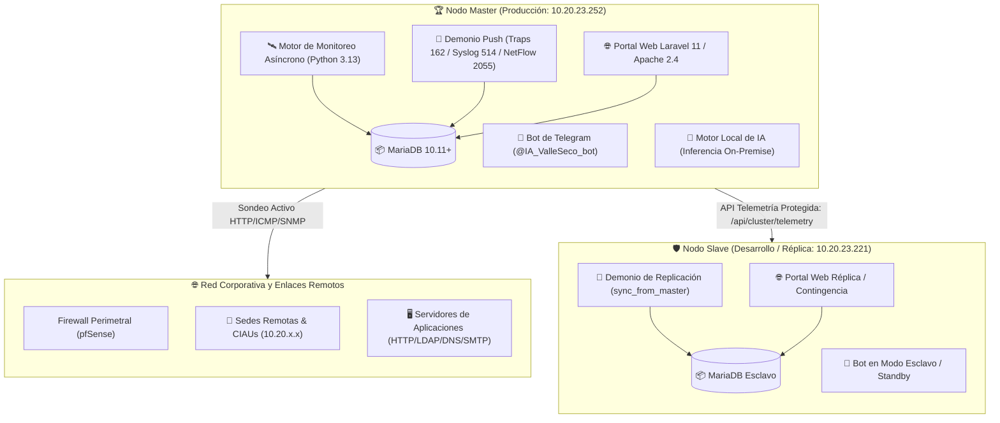
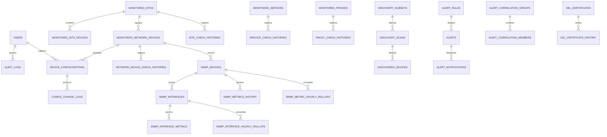
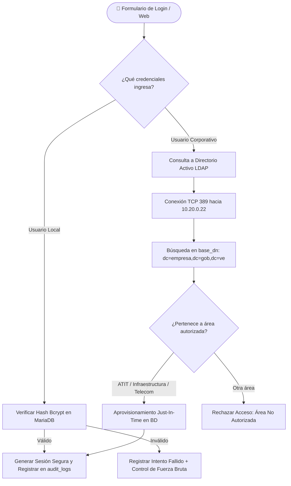
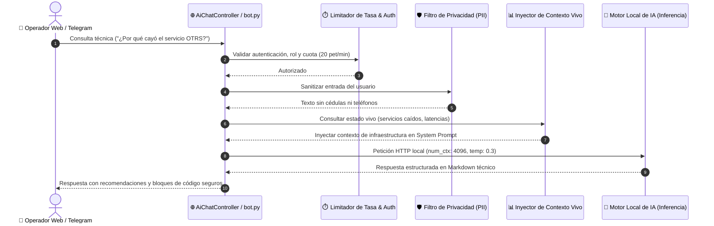

# 📑 DOCUMENTO DE REQUISITOS DEL PRODUCTO (PRD)
## Sistema Integral de Monitoreo, Telemetría y Asistencia Automatizada Valle Seco

---

### 📋 Control del Documento

| Parámetro | Detalle |
|---|---|
| **Nombre del Producto:** | Plataforma Integral de Monitoreo y Administración Valle Seco |
| **Identificadores del Sistema:** | `@IA_ValleSeco_bot` (Telegram) / Portal Web Corporativo ATIT |
| **Versión Actual:** | **v3.2.0** (Fase 8 Consolidada + Alertas Selectivas Reactivas) |
| **Entorno de Despliegue:** | Clúster Alta Disponibilidad Master (`10.20.23.252`) / Slave (`10.20.23.221`) |
| **Sistema Operativo:** | Debian 12 / 13 GNU/Linux (amd64) |
| **Fecha de Emisión:** | 28 de Septiembre de 2026 |
| **Estado:** | En Producción Operativa / Certificado |
| **Clasificación:** | Documentación de Ingeniería y Arquitectura de Software |

---

## 1. 🌟 VISIÓN GENERAL Y PROPÓSITO DEL SISTEMA

### 1.1. Misión del Producto
La **Plataforma Integral de Monitoreo y Administración Valle Seco** es una solución enterprise desarrollada para centralizar, supervisar de forma ininterrumpida y gestionar proactivamente la infraestructura tecnológica, telecomunicaciones, servidores y servicios corporativos de la sede principal de Valle Seco y sus sedes remotas asociadas (Centros Integrales de Atención al Usuario - CIAU y subestaciones eléctricas).

### 1.2. Objetivos Principales
1. **Supervisión de Alta Disponibilidad:** Detección de fallas en menos de 2.5 segundos en servicios web corporativos, infraestructura de red WAN/LAN, enlaces a sedes remotas y túneles proxy.
2. **Paridad y Doble Interfaz:** Integración armónica entre un **Panel Web Moderno** (interfaz Cyberpunk Obsidian) y un **Bot de Administración en Telegram**, garantizando acceso inmediato tanto desde terminales fijas como desde dispositivos móviles de los ingenieros de guardia.
3. **Soporte y Gestión Remota sin Clientes Externos:** Consola integrada en navegador web para diagnóstico inmediato de equipos de red y estaciones de trabajo mediante clientes web de **SSH (xterm.js), Telnet y VNC (noVNC)**.
4. **Alertas Selectivas Inteligentes:** Capacidad de activar notificaciones reactivas individualizadas por servicio o dispositivo, permitiendo dirigir eventos de caída y recuperación al chat privado del Administrador o al grupo corporativo con cálculo del tiempo de indisponibilidad.
5. **Observabilidad Avanzada y Flujos de Red:** Ingesta en tiempo real de trampas SNMP (UDP 162), bitácora Syslog (UDP 514) y análisis de protocolos/Top Talkers con NetFlow v5 (UDP 2055).
6. **Asistente Virtual e Inteligencia Artificial Privada:** Soporte y asistencia técnica asistida por un **Motor Local de IA**, garantizando procesamiento local de lenguaje natural y telemetría sin enviar información fuera de la red física institucional.
7. **Arquitectura Distribuida en Clúster:** Separación estricta entre nodo **Master** y nodo **Slave** con replicación API bidireccional continua para evitar saturación de enlaces y cortafuegos perimetrales.
8. **Resiliencia Operativa y GitOps:** Despliegue seguro mediante respaldos atómicos de base de datos, Circuit Breaker, auto-curación de 5 capas y procedimientos automatizados de rollback.

---

## 2. 🏛️ ARQUITECTURA TECNOLÓGICA Y TOPOLOGÍA DE CLÚSTER

### 2.1. Topología Distribuida Master - Slave



### 2.2. Roles y Diferenciación de Nodos
* **Nodo Master (`10.20.23.252`):**
  - Ejecuta el ciclo continuo de escaneo activo (HTTP, ICMP, SNMP, DNS, LDAP, CUPS).
  - Escucha y consolida la telemetría push en puertos UDP (162, 514, 2055).
  - Gestiona la cola y despacho de notificaciones a Telegram (alertas reactivas y cron de reportes).
  - Expone el endpoint protegido `/api/cluster/telemetry` mediante autenticación estricta con token de cabecera `X-Cluster-Token`.
* **Nodo Slave (`10.20.23.221`):**
  - No genera tráfico directo hacia las sedes ni satura el firewall pfSense.
  - Consume cada 1 a 2 minutos el snapshot oficial y catálogo completo desde el Master.
  - Sincroniza en tiempo real las tablas maestras de catálogo y las 4 tablas de telemetría histórica (`service_check_histories`, `site_check_histories`, `proxy_check_histories`, `network_device_check_histories`).
  - Redirige cualquier despacho de prueba estrictamente al Administrador Privado (`38914901`), protegiendo el grupo institucional de mensajes de simulación.

### 2.3. Stack de Componentes

| Capa | Tecnologías Seleccionadas |
|---|---|
| **Sistema Operativo** | Debian GNU/Linux 12 / 13 (amd64, Kernel Linux 6.x) |
| **Backend Web** | Laravel 11.x (PHP 8.2+ con extensiones LDAP, PDO, cURL, OpenSSL, sockets, GD) |
| **Servidor Web** | Apache 2.4 con módulos `mpm_event` / `mpm_prefork`, `mod_rewrite`, `mod_headers`, `mod_proxy` |
| **Motor Asíncrono / CLI** | Python 3.11 / 3.13 con `asyncio`, `httpx`, `pymysql`, `pydantic`, `cryptography` |
| **Mensajería & Bot** | Python `python-telegram-bot` v21+ con arquitectura asíncrona no bloqueante |
| **Base de Datos** | MariaDB 10.11+ con motor de almacenamiento InnoDB y transacciones ACID |
| **Frontend Web** | TailwindCSS, Alpine.js, Chart.js 4.x, Cytoscape.js (grafos de topología) |
| **Terminales Web** | `xterm.js` con `fit-addon` (SSH/Telnet), `noVNC` sobre WebSockets (`websockify`) |
| **Observabilidad Push** | Receptores UDP para SNMP Traps (162), Syslog RFC 3164/5424 (514), NetFlow v5 (2055) |
| **Inteligencia Artificial** | Asistente Virtual Corporativo impulsado por Motor Local de IA (auto-hospedado) |

---

## 3. 🗄️ MODELO Y ESTRUCTURA DE BASE DE DATOS (MARIADB)

El esquema de base de datos (`monitoreo_vs`) está compuesto por **63 tablas** organizadas en módulos de alta cohesión y bajo acoplamiento:

```
┌────────────────────────────────────────────────────────────────────────┐
│                        MAPA MODULAR DE TABLAS                          │
├────────────────────────────────┬───────────────────────────────────────┤
│ 1. Telemetría Core (10 tablas) │ 7. Telemetría Push (4 tablas)         │
│ 2. SNMP y Métricas (9 tablas)  │ 8. Topología e Inteligencia (4 tablas)│
│ 3. Descubrimiento (8 tablas)   │ 9. Seguridad y Usuarios (6 tablas)    │
│ 4. Alertas y Escalamiento (8)  │ 10. Telegram y Bot (4 tablas)         │
│ 5. Certificados SSL (2 tablas) │ 11. Soporte y Laravel (6 tablas)      │
│ 6. Configuración GitOps (2)    │                                       │
└────────────────────────────────┴───────────────────────────────────────┘
```

### 3.1. Diagrama Entidad-Relación (ERD) Consolidado



---

### 3.2. Catálogo Detallado de Tablas y Esquemas

#### Grupo 1: Monitoreo Core y Telemetría Histórica

1. **`monitored_services`**: Catálogo maestro de servicios corporativos supervisados.
   - `id` (BIGINT UNSIGNED, PK, AI)
   - `letter` (VARCHAR(10)): Identificador alfanumérico (ej. `S1`, `A`, `B`).
   - `name` (VARCHAR(255)): Nombre descriptivo del servicio.
   - `type` (VARCHAR(50)): Protocolo (`WEB`, `LDAP`, `SMTP`, `DNS`, `CUPS`, `PING`, `PROXY`).
   - `scope` (VARCHAR(50)): Ámbito de red (`corporativo` o `regional`).
   - `host_ip` (VARCHAR(255)): Dirección IP o nombre de host resoluble.
   - `web_url` (VARCHAR(500)): URL completa para chequeos HTTP/HTTPS.
   - `port` (INT): Puerto TCP/UDP específico.
   - `credentials` (VARCHAR(255)): Credenciales básicas o tokens de prueba.
   - `check_interface` (VARCHAR(50)): Interfaz de red de salida (ej. `eno1`).
   - `dns_test_domain` (VARCHAR(255)): Dominio FQDN para probar consultas DNS.
   - `normal_state_msg` / `error_state_msg` (VARCHAR(255)): Mensajes personalizados de Telegram.
   - `is_active` (TINYINT(1), Default 1): Indicador de supervisión habilitada.
   - `sort_order` (INT, Default 0): Orden visual en tableros.
   - `telegram_alert_enabled` (TINYINT(1), Default 0): **Interruptor selectivo de alertas Telegram.**
   - `telegram_alert_target` (VARCHAR(20), Default `'owner'`): **Destino (`'owner'` o `'group'`).**
   - `last_alert_state` (VARCHAR(10), Nullable): Último estado notificado (`'UP'`, `'DOWN'`).
   - `down_since` (DATETIME, Nullable): Marca de tiempo del inicio de la caída.
   - `created_at` / `updated_at` (TIMESTAMP)

2. **`service_check_histories`**: Telemetría de series temporales de servicios (retención 30 días).
   - `id` (BIGINT UNSIGNED, PK, AI)
   - `monitored_service_id` (BIGINT UNSIGNED, FK)
   - `is_up` (TINYINT(1)): 1 si respondió satisfactoriamente, 0 si falló.
   - `latency_ms` (DECIMAL(8,2)): Tiempo de respuesta en milisegundos.
   - `http_code` (VARCHAR(20)): Código HTTP retornado o descripción del socket (`200 OK`, `Timeout`).
   - `status_message` (TEXT): Diagnóstico del chequeo.
   - `checked_at` (TIMESTAMP, Index): Marca de tiempo exacta del sondeo.

3. **`monitored_sites`**: Catálogo de sedes remotas y oficinas comerciales.
   - `id` (BIGINT UNSIGNED, PK, AI)
   - `letter` (VARCHAR(10)): Código de sede (ej. `ST1`, `ST2`).
   - `name` (VARCHAR(255)): Nombre de la sede (ej. `CIAU Puerto Cabello`).
   - `ip` (VARCHAR(255)): Dirección IP de enlace de la sede.
   - `address` (TEXT): Ubicación física.
   - `phone_1` hasta `phone_8` (VARCHAR(50)): Contactos de emergencia de la sede.
   - `is_active` (TINYINT(1)): Estado operativo de la supervisión.
   - `sort_order` (INT): Secuencia de ordenamiento.

4. **`monitored_site_devices`**: Equipos asociados a una sede específica.
   - `id` (BIGINT UNSIGNED, PK, AI)
   - `monitored_site_id` (BIGINT UNSIGNED, FK)
   - `device_number` (INT): Número correlativo dentro de la sede.
   - `name` (VARCHAR(255)): Nombre del equipo (ej. `Switch Core Sede`, `PC Taquilla 1`).
   - `ip` (VARCHAR(255)): IP asignada.
   - `mac` (VARCHAR(50)): Dirección física Ethernet.
   - `access_type` (VARCHAR(50)): Protocolo de soporte (`SSH`, `TELNET`, `WEB`, `VNC`, `SIN SOPORTE`).
   - `access_port` (INT): Puerto del servicio de acceso.
   - `model` / `serial` / `ports` / `notes` (TEXT / VARCHAR)
   - `telegram_alert_enabled` / `telegram_alert_target` / `last_alert_state` / `down_since`

5. **`site_check_histories`**: Telemetría histórica de conectividad de sedes y sus equipos.
   - `id` (BIGINT UNSIGNED, PK, AI), `monitored_site_id` (FK), `is_up`, `latency_ms`, `packet_loss_pct`, `checked_at`.

6. **`monitored_network_devices`**: Inventario de conmutadores, enrutadores y equipos de la red física.
   - `id` (BIGINT UNSIGNED, PK, AI)
   - `monitored_site_id` (BIGINT UNSIGNED, Nullable, FK)
   - `device_number` (INT, Default 1)
   - `name` (VARCHAR(255)): Nombre corporativo del nodo de red.
   - `ip` (VARCHAR(255), Unique): Dirección IP de gestión.
   - `mac` (VARCHAR(50)): MAC Address.
   - `vendor_data` (VARCHAR(255)): Información de fabricante / OUI.
   - `access_type` (VARCHAR(50)): `SSH`, `TELNET`, `WEB`, `VNC`, `SIN SOPORTE`.
   - `access_port` (INT): Puerto de gestión (`22`, `23`, `80`, `5900`).
   - `ssh_username` (VARCHAR(100)): Usuario para conexión o respaldo.
   - `ssh_password_encrypted` (TEXT): **Contraseña cifrada con AES-256.**
   - `ssh_enable_secret_encrypted` (TEXT): **Contraseña enable Cisco cifrada con AES-256.**
   - `model` (VARCHAR(255)): Modelo del equipo.
   - `serial` (VARCHAR(100)): Serial de hardware.
   - `telegram_alert_enabled` (TINYINT(1)): Alertas activadas.
   - `telegram_alert_target` (VARCHAR(20)): Destino de alertas (`owner` o `group`).
   - `last_alert_state` (VARCHAR(10)): Estado (`UP`/`DOWN`).
   - `down_since` (DATETIME): Fecha/hora inicio de la falla.

7. **`network_device_check_histories`**: Histórico de disponibilidad y latencia de equipos de red.

8. **`monitored_proxies`**: Enlaces de salida a Internet y firewalls proxy.
   - `id` (BIGINT UNSIGNED, PK, AI)
   - `letter` (VARCHAR(5)): `A`, `B`, `C`, `D`.
   - `name` (VARCHAR(255)): Ej. `PFsense - CARABOBO (89)`.
   - `ip_port` (VARCHAR(100)): Dirección y puerto (`10.20.0.89:8080`).
   - `auth_userpass` (VARCHAR(255)): Credenciales en formato `usuario:clave`.
   - `test_url` (VARCHAR(500)): URL para probar navegación por el túnel.
   - `is_active` (TINYINT(1))

9. **`proxy_check_histories`**: Telemetría de disponibilidad y rendimiento de túneles proxy.

10. **`monitoring_snapshots`**: Instantánea global JSON del estado del clúster (desacoplamiento de alta velocidad).
    - `id` (BIGINT UNSIGNED, PK, AI)
    - `payload_json` (LONGTEXT): Snapshot con estados de todas las entidades.
    - `status` (VARCHAR(20)): `OPERACIONAL`, `DEGRADADO`, `CRITICO`.
    - `services_up` / `services_total`, `sites_up` / `sites_total`.
    - `generated_at` (TIMESTAMP, Index)

---

#### Grupo 2: SNMP y Telemetría de Rendimiento

11. **`snmp_devices`**: Equipos configurados con agente de sondeo SNMP.
    - `id`, `name`, `ip_address`, `snmp_version` (`v1`, `v2c`, `v3`), `snmp_port` (161), `snmp_community_encrypted`, `snmp_timeout_seconds`, `device_type`, `sys_name`, `sys_description`, `sys_uptime`, `is_active`, `last_poll_at`, `last_poll_status`.
12. **`snmp_oids`**: Diccionario de identificadores de objeto SNMP (CPU, RAM, Temp, etc.).
13. **`snmp_device_oids`**: Asociación M:N entre equipos y OIDs específicos a sondear.
14. **`snmp_interfaces`**: Interfaces de red descubiertas vía IF-MIB (`ifIndex`, `ifDescr`, `ifType`, `ifSpeed`, `ifAdminStatus`, `ifOperStatus`, `ifPhysAddress`).
15. **`snmp_metrics_history`**: Series de tiempo de CPU, memoria, temperatura y almacenamiento.
16. **`snmp_interface_metrics`**: Tráfico de red en interfaces (`ifInOctets`, `ifOutOctets`, `in_bps`, `out_bps`, errores y descartes).
17. **`snmp_metric_hourly_rollups`**: Rollups horarios consolidados de métricas de host (mínimo, máximo, promedio).
18. **`snmp_interface_hourly_rollups`**: Rollups horarios consolidados de consumo de ancho de banda.
19. **`snmp_activation_log`**: Registro de auditoría de activación y configuración de agentes SNMP.

---

#### Grupo 3: Descubrimiento de Red y Radar Pasivo

20. **`discovery_subnets`**: Subredes CIDR configuradas para barrido (ej. `10.20.23.0/24`).
21. **`discovery_scans`**: Bitácora de escaneos automáticos o manuales ejecutados.
22. **`discovered_devices`**: Equipos detectados en la red (IP, MAC, vendor OUI, hostname, puertos abiertos, estado de autorización: `authorized`, `unauthorized`, `rogue`).
23. **`discovered_device_history`**: Seguimiento histórico de primeras y últimas detecciones.
24. **`oui_vendors`**: Tabla estática de prefijos IEEE para resolución de fabricantes por dirección MAC.
25. **`net_radar_hosts`**: Hosts activos monitoreados pasivamente por volumen de tráfico.
26. **`net_radar_events`**: Eventos del radar (nuevas IPs, cambios de MAC, anomalías de enlace).
27. **`net_radar_snapshots`**: Instantáneas periódicas de ocupación de subredes.

---

#### Grupo 4: Alertas, Correlación y Escalación

28. **`alert_rules`**: Reglas dinámicas de umbral (`entity_type`, `metric_name`, `operator`, `threshold_value`, `duration_seconds`, `severity`: `warning`, `critical`, `fatal`).
29. **`alert_escalation_levels`**: Niveles escalonados de notificación (Nivel 1 inmediato, Nivel 2 a los X minutos, Nivel 3 a administradores superiores).
30. **`alert_correlation_groups`**: Agrupaciones lógicas y jerárquicas para correlación de fallas.
31. **`alert_correlation_members`**: Vínculo entre reglas de alerta y grupos de correlación.
32. **`alerts`**: Registro de incidencias vivas e históricas (`fingerprint_sha256`, `status`: `firing`, `acknowledged`, `resolved`, `auto_resolved`, `fired_at`, `resolved_at`).
33. **`alert_notifications`**: Pista de auditoría de despachos de alertas (destinatario, canal, estado).
34. **`maintenance_windows`**: Ventanas programadas de mantenimiento para silenciar alertas preventivamente.
35. **`alert_storm_suppression`**: Mecanismo de mitigación contra tormentas de alertas y *flapping*.

---

#### Grupo 5: Respaldos y GitOps (Cisco IOS / Network Devices)

36. **`device_configurations`**: Histórico inmutable de respaldos de configuraciones (`running-config`).
    - `id`, `network_device_id` (FK), `config_text` (LONGTEXT), `config_hash` (SHA-256), `config_size_bytes`, `captured_at`, `captured_by` (`auto_cron` o usuario).
37. **`config_change_logs`**: Detección de diferencias (`diff -u`) entre respaldos sucesivos con alertas automáticas.

---

#### Grupo 6: Telemetría Push (UDP Ingestion)

38. **`snmp_traps_received`**: Registro de trampas SNMP capturadas en puerto UDP 162.
39. **`syslog_events`**: Registro centralizado de mensajes Syslog recibidos en puerto UDP 514 (RFC 3164 / RFC 5424).
40. **`netflow_records`**: Registros crudos de flujos NetFlow v5 recibidos en puerto UDP 2055.
41. **`netflow_top_talkers`**: Agregación consolidada de los principales consumidores de ancho de banda.

---

#### Grupo 7: Topología, Ciclo de Vida y Capacidad Predictiva

42. **`network_topology_links`**: Enlaces físicos o lógicos entre dispositivos de red para renderizado en grafo Cytoscape.js (`source_device_id`, `target_device_id`, `source_interface`, `target_interface`, `link_type`, `speed_mbps`, `status`).
43. **`predictive_anomalies`**: Detección estadística de anomalías de telemetría (desviación estándar / z-score sobre latencias y tráfico).
44. **`hardware_lifecycle`**: Fichas de ciclo de vida ITIL de equipos (fechas de adquisición, fin de soporte EoL/EoS, pólizas de garantía y proveedores).
45. **`wol_devices`**: Libreta de direcciones para encendido remoto por Magic Packet Wake-on-LAN (`mac_address`, `broadcast_ip`, `port`, `last_wake_at`).

---

#### Grupo 8: Seguridad, Identidad y Auditoría Forense

46. **`users`**: Cuentas de acceso al sistema con autenticación híbrida (Local / LDAP) y control de roles.
47. **`audit_logs`**: Registro inmutable de cada acción administrativa ejecutada en el sistema.
48. **`banned_ips`**: Direcciones IP bloqueadas por intentos fallidos de autenticación o reglas de escudo.
49. **`sessions`**: Almacenamiento seguro de sesiones web en base de datos.
50. **`password_reset_tokens`**: Tokens criptográficos de recuperación de acceso.
51. **`network_analysis_reports`**: Informes consolidados de auditoría y análisis de red.

---

#### Grupo 9: Telegram y Gestión Dinámica del Bot

52. **`bot_commands`**: Registro dinámico de comandos del bot, nivel de acceso y estado activo/bloqueado.
53. **`bot_message_templates`**: Plantillas editables para mensajes de estatus, caídas y reportes.
54. **`bot_settings`**: Parámetros de operación en tiempo real del bot.
55. **`telegram_dispatches`**: Cola de mensajes y registro de envíos procesados.

---

#### Grupo 10: Infraestructura y Framework Laravel

56. **`migrations`**: Control de versiones de esquema de base de datos.
57. **`jobs`**, **`job_batches`**, **`failed_jobs`**: Sistema de colas y trabajadores en segundo plano.
58. **`cache`**, **`cache_locks`**: Capa de caché atómica de la aplicación.
59. **`ssl_certificates`**, **`ssl_certificate_history`**: Catálogo e histórico de inspección criptográfica SSL.

---

## 4. 👥 GESTIÓN DE USUARIOS, AUTENTICACIÓN Y MATRIZ DE PERMISOS (RBAC)

### 4.1. Mecanismos de Autenticación Híbrida



1. **Autenticación Local:**
   - Contraseñas protegidas mediante algoritmos de derivación de claves `bcrypt` con costo de cómputo adaptativo.
   - Protección contra ataques de fuerza bruta mediante `RateLimiter` y baneo automático en `banned_ips`.
2. **Autenticación de Directorio Activo LDAP:**
   - Servidor institucional: `10.20.0.22` (puerto `389`).
   - Base DN: `dc=empresa,dc=gob,dc=ve`.
   - Filtro de áreas organizacionales autorizadas: `ATIT`, `GPO TRAB INFRA TECNOL CARABOBO`, `INFRAESTRUCTURA`, `TELECOMUNICACIONES`.
   - **Aprovisionamiento Just-In-Time (JIT):** Si el usuario valida exitosamente sus credenciales LDAP y pertenece al área técnica autorizada, el sistema crea o actualiza automáticamente su registro local en `users` asignando el rol base de `operator` y sincronizando su nombre completo y correo corporativo.

---

### 4.2. Jerarquía de Roles de Usuario

| Rol | Denominación | Nivel de Privilegios | Propósito Operativo |
|---|---|---|---|
| `admin` / `SuperAdmin` | **Administrador del Sistema** | **Total e Irrestricto** | Configuración de clúster, edición técnica de servicios y equipos, acceso a credenciales SSH maestras, gestión de usuarios, desbloqueo de comandos y auditoría. |
| `operator` | **Operador de Red / Soporte** | **Operativo Granular** | Supervisión en vivo de servicios y sedes, apertura de terminales de soporte (SSH, Telnet, VNC), reconocimiento de alertas (ACK), ejecución de escaneos y encendido remoto (WOL). No tiene acceso a claves maestras ni a gestión de usuarios. |
| `viewer` | **Visualizador / Guardia** | **Solo Lectura** | Consulta de dashboards en pantallas de pared, telemetría y reportes consolidados sin permisos de alteración ni acceso a consolas remotas. |

---

### 4.3. Matriz Exhaustiva de Permisos Granulares (RBAC)

El sistema implementa el servicio [`PermissionService`](file:///scripts/telegram-admin-bot/web_portal/app/Services/PermissionService.php) que evalúa dinámicamente cada acción del operador:

| Módulo | Clave de Permiso | Nombre del Permiso | Operador por Defecto |
|---|---|---|:---:|
| **Infraestructura (`infra`)** | `infra.view` | Consultar estado, latencias e históricos de servicios y sedes | ✅ |
| | `infra.manage_services` | Crear, editar, alternar alertas y eliminar servicios | ❌ (Solo Admin) |
| | `infra.manage_sites` | Crear, editar y eliminar sedes y enlaces WAN | ❌ (Solo Admin) |
| | `infra.manage_devices` | Crear, editar parámetros y eliminar equipos de red | ❌ (Solo Admin) |
| | `infra.manage_proxies` | Configurar y validar servidores proxy corporativos | ❌ (Solo Admin) |
| | `infra.scan_now` | Disparar escaneo completo inmediato de toda la red | ❌ (Solo Admin) |
| **Terminales Remotas (`remote`)** | `remote.ssh` | Abrir terminal SSH interactiva web en routers y switches | ✅ |
| | `remote.telnet` | Abrir terminal Telnet web en equipos legados | ✅ |
| | `remote.vnc` | Abrir escritorio remoto web noVNC hacia estaciones | ✅ |
| **Respaldos Cisco (`cisco`)** | `cisco.view` | Consultar catálogo de respaldos y visor de diferencias (Diff) | ✅ |
| | `cisco.backup_run` | Ejecutar respaldo manual en caliente de running-config | ❌ (Solo Admin) |
| | `cisco.credentials_edit`| Modificar contraseñas y secretos SSH cifrados en AES-256 | ❌ (Solo Admin) |
| **Telemetría SNMP (`snmp`)** | `snmp.view` | Visualizar métricas de CPU/RAM, gráficos y estado de puertos | ✅ |
| | `snmp.manage` | Registrar comunidades, versiones SNMP y OIDs personalizados | ❌ (Solo Admin) |
| | `snmp.poll` | Forzar sondeo SNMP inmediato en caliente | ❌ (Solo Admin) |
| **Descubrimiento (`discovery`)** | `discovery.view` | Consultar catálogo de dispositivos detectados y subredes | ✅ |
| | `discovery.scan` | Lanzar barrido CIDR en subredes configuradas | ❌ (Solo Admin) |
| | `discovery.authorize` | Marcar equipos como autorizados o amenazas *rogue* | ❌ (Solo Admin) |
| **NET Radar (`netradar`)** | `netradar.view` | Visualizar hosts activos, volumen y monitoreo de tráfico | ✅ |
| | `netradar.export` | Descargar reportes estructurados (.md) y telemetría | ✅ |
| | `netradar.scan` | Forzar captura y análisis activo en vivo | ❌ (Solo Admin) |
| **Certificados SSL (`ssl`)** | `ssl.view` | Consultar vigencia, emisores y días restantes de certificados | ✅ |
| | `ssl.manage` | Agregar o eliminar dominios HTTPS en la auditoría SSL | ❌ (Solo Admin) |
| | `ssl.recheck` | Forzar verificación criptográfica de certificados en caliente | ❌ (Solo Admin) |
| **Alertas (`alerts`)** | `alerts.view` | Consultar alertas activas e incidencias históricas | ✅ |
| | `alerts.ack` | Reconocer (ACK) y silenciar temporalmente incidencias | ✅ |
| | `alerts.rules` | Crear y modificar reglas de umbral y correlación | ❌ (Solo Admin) |
| | `alerts.maintenance` | Programar o cancelar ventanas de mantenimiento | ❌ (Solo Admin) |
| **Telegram (`telegram`)** | `telegram.dispatch` | Despachar reporte oficial manual al grupo corporativo | ✅ |
| | `telegram.templates` | Modificar redacción y formatos de plantillas oficiales | ❌ (Solo Admin) |
| | `telegram.commands` | Habilitar o deshabilitar comandos dinámicos del bot | ❌ (Solo Admin) |
| **Inteligencia Artificial (`ai`)** | `ai.chat` | Consultar diagnósticos y soporte al Motor Local de IA | ✅ |
| **Seguridad (`security`)** | `security.users` | Crear, suspender y administrar cuentas de usuario | ❌ (Solo Admin) |
| | `security.permissions` | Asignar y modificar permisos granulares de operadores | ❌ (Solo Admin) |
| | `security.bans` | Consultar y desbloquear direcciones IP bloqueadas | ❌ (Solo Admin) |
| | `security.audit` | Consultar la pista inmutable de auditoría forense | ❌ (Solo Admin) |
| | `security.audit_export`| Exportar eventos de auditoría en formato CSV o JSON | ❌ (Solo Admin) |
| | `security.advanced` | Modificar parámetros de clúster, LDAP y cron | ❌ (Solo Admin) |
| **SNMP Traps (`traps`)** | `traps.view` | Consultar trampas SNMP capturadas y VarBinds | ✅ |
| | `traps.process` | Marcar trampas SNMP como atendidas o procesadas | ❌ (Solo Admin) |
| **Syslog (`syslog`)** | `syslog.view` | Ver flujo en tiempo real de registros syslog y filtrar | ✅ |
| **NetFlow (`netflow`)** | `netflow.view` | Ver telemetría de flujos, protocolos y Top Talkers | ✅ |
| **Topología (`topology`)** | `topology.view` | Visualizar mapa gráfico interactivo de nodos y enlaces | ✅ |
| | `topology.rebuild` | Forzar reconstrucción de topología por CDP/LLDP | ❌ (Solo Admin) |
| **Wake-on-LAN (`wol`)** | `wol.view` | Consultar inventario de estaciones para encendido remoto | ✅ |
| | `wol.wake` | Emitir Magic Packet UDP broadcast para encender equipos | ❌ (Solo Admin) |
| | `wol.manage` | Gestionar catálogo de equipos Wake-on-LAN | ❌ (Solo Admin) |
| **IA Predictiva (`predictive`)** | `predictive.view` | Visualizar alertas tempranas de degradación y anomalías | ✅ |
| | `predictive.run` | Disparar cálculo estadístico de tendencias y outliers | ❌ (Solo Admin) |
| | `predictive.manage` | Atender o descartar anomalías predictivas | ❌ (Solo Admin) |
| **Ciclo de Vida (`lifecycle`)** | `lifecycle.view` | Consultar garantías, fechas de compra y fin de soporte | ✅ |
| | `lifecycle.manage` | Gestionar fichas de hardware y garantías | ❌ (Solo Admin) |

---

## 5. ⚙️ FUNCIONES Y MÓDULOS DEL SISTEMA

### 5.1. Monitoreo Core y Telemetría Reactiva
* **Sondeo Multiprocolo:** Chequeo concurrente asíncrono implementado en Python `httpx` y sockets de red.
  - **Servicios Web (HTTP/HTTPS):** Contexto permisivo SSL (`SSL_PERMISSIVE_CTX`), soporte TLS legacy, seguimiento de redirecciones y medición de latencia con resolución sub-milisegundo.
  - **Infraestructura de Directorio (LDAP):** Apertura de socket TCP al puerto 389/636.
  - **Correo Electrónico (SMTP):** Verificación de banner y escucha en puerto 25/587.
  - **Resolución de Nombres (DNS):** Verificación de puerto 53 en servidores primario y secundario.
  - **Servidores de Impresión (CUPS):** Verificación en puerto 631.
  - **Sedes y Dispositivos (ICMP Ping):** Paquetes ICMP concurrentes con cálculo de porcentaje de pérdida de paquetes y latencia media.
* **Alertas Selectivas por Ítem (Owner / Grupo Corporativo):**
  - Cada servicio y cada equipo de red dispone en base de datos y en el panel web de una casilla individual para activar alertas de Telegram.
  - Selector de destino:
    - **`owner`:** Notificación despachada exclusivamente al Administrador Privado (`38914901`).
    - **`group`:** Notificación enviada al grupo corporativo (`-1001383163558`).
  - **Detección de Caída (UP ➔ DOWN):** Al detectar falla o timeout, despacha de inmediato una alerta técnica con URL/IP, protocolo y código de diagnóstico.
  - **Supresión de Spam:** Si el equipo continúa caído en revisiones posteriores, **no reenvía** mensajes continuos para no saturar los canales de comunicación.
  - **Notificación de Recuperación (DOWN ➔ UP):** Al restablecerse la conectividad, despacha automáticamente el aviso de restablecimiento calculando el **tiempo total exacto de indisponibilidad** (ej. `45 seg`, `12 min 30 seg`, `2 h 15 min`) y la latencia actual.

---

### 5.2. Terminales Web Remotas y Soporte de Infraestructura
* **WebSSH Interactivo:**
  - Terminal integrada en navegador web utilizando `xterm.js` y el protocolo WebSocket a través de `websockify` y `wssh` (puerto `6082`).
  - Permite a los ingenieros conectarse a conmutadores y enrutadores directamente desde la ficha del equipo sin instalar Putty o clientes locales.
* **WebTelnet:**
  - Emulación para switches y equipos legados que no soportan SSHv2.
* **WebVNC (noVNC):**
  - Escritorio remoto gráfico integrado para brindar soporte en caliente a taquillas de recaudación CIAU y estaciones operativas.
  - Conexión cifrada WebSocket a puerto `6080`.
* **Cifrado de Credenciales:**
  - Los usuarios, contraseñas y secretos de acceso de conmutadores se almacenan cifrados con **AES-256-CBC** y vector de inicialización único mediante la llave criptográfica institucional de Laravel.

---

### 5.3. Descubrimiento de Red (Network Discovery) y Radar Pasivo
* **Descubrimiento Activo CIDR:**
  - Barrido programado cada 15 minutos en subredes locales (ej. `10.20.23.0/24`).
  - Detección de direcciones IP ocupadas, direcciones MAC físicas y resolución de fabricantes mediante catálogo IEEE OUI.
  - Clasificación de dispositivos en: Autorizados (`authorized`), Pendientes (`unauthorized`) o Amenazas (`rogue`).
* **NET Radar de Tráfico:**
  - Monitoreo del volumen de tráfico generado por los hosts de la subred.
  - Identificación de estaciones que descargan paquetes pesados de actualización (detección de patrones de Windows Update y repositorios Linux).

---

### 5.4. Telemetría SNMP Avanzada y Series de Tiempo
* **Agente de Sondeo SNMP (`snmp_poller.py`):**
  - Soporte para versiones SNMP `v1`, `v2c` y `v3`.
  - Recolección de CPU, uso de memoria RAM, temperatura interna y tiempo de actividad (`sysUpTime`).
* **Supervisión de Interfaces de Red (IF-MIB):**
  - Mapeo de interfaces de conmutadores: estado administrativo (`ifAdminStatus`), estado operativo (`ifOperStatus`), ancho de banda en tiempo real (`ifInOctets`, `ifOutOctets`, bps), errores de entrada/salida y descartes de paquetes.
* **Rollups Horarios Consolidados:**
  - Proceso de agregación horaria que calcula promedios, valores mínimos y máximos, garantizando gráficos históricos fluidos y una política estricta de retención de 30 días sin degradar el rendimiento de la base de datos.

---

### 5.5. Auditoría de Certificados SSL/TLS
* **Inspección Criptográfica Automatizada:**
  - Conexión TLS hacia sitios corporativos y plataformas web internas.
  - Extracción de metadatos X.509: Nombre Común (CN), Autoridad Certificadora (CA emisora), fecha de inicio y fecha de vencimiento.
* **Alertas Preventivas de Caducidad:**
  - Cálculo de días restantes de vigencia.
  - Clasificación de estado: `Válido` (> 30 días), `Advertencia` (<= 30 días), `Crítico` (<= 7 días) o `Expirado`.

---

### 5.6. Motor de Alertas, Correlación y Escalación
* **Deduplicación por Huella Digital (SHA-256):**
  - Generación de un *fingerprint* unívoco por cada evento combinando entidad, métrica y tipo de alarma para evitar duplicidad.
* **Control de Tormentas y Flapping:**
  - Ventana de amortiguamiento (*cooldown*) que neutraliza ráfagas de alertas causadas por enlaces intermitentes.
* **Supresión por Ventanas de Mantenimiento:**
  - Las paradas programadas en `maintenance_windows` silencian temporalmente los despachos hacia Telegram sin interrumpir la recolección de métricas.
* **Correlación Topológica Padre-Hijo:**
  - Si un conmutador de distribución principal se encuentra caído, el motor suprime automáticamente las alertas secundarias de las estaciones conectadas a dicho equipo, evitando inundar al equipo de guardia con falsos positivos en cascada.
* **Escalación Escalonada:**
  - Nivel 1: Despacho inmediato al canal asignado.
  - Nivel 2: Si no ha sido reconocido (ACK) en 15 minutos, reenvío con prioridad alta.
  - Nivel 3: Si persiste por más de 60 minutos, escalación a jefatura de infraestructura.

---

### 5.7. Respaldos Automatizados de Configuración (GitOps)
* **Captura Desatendida de `running-config`:**
  - Ejecución programada vía SSH/Telnet hacia conmutadores y enrutadores Cisco y Mikrotik.
  - Extracción limpia de la configuración en texto plano y cálculo de firma criptográfica SHA-256.
* **Detección de Cambios y Versionado:**
  - Comparación en tiempo real (`diff -u`) entre la configuración anterior y la recién descargada.
  - Registro de auditoría con la línea exacta modificada, agregada o eliminada, notificando alteraciones no autorizadas en la infraestructura.

---

### 5.8. Demonio Unificado de Telemetría Push (`push_telemetry_daemon.py`)
* **Receptor SNMP Traps (UDP 162):**
  - Captura asíncrona de trampas push emitidas por conmutadores y UPS corporativas (apagones, fallas de batería, enlaces caídos linkDown).
* **Servidor Syslog Centralizado (UDP 514):**
  - Recepción y decodificación de mensajes de bitácora conforme a los estándares RFC 3164 y RFC 5424.
* **Colector NetFlow v5 (UDP 2055):**
  - Deserialización binaria de cabeceras y registros de flujo NetFlow.
  - Agregación en memoria volátil (`FlowBuffer`) para calcular los **Top Talkers** de la red institucional (IP origen, IP destino, puertos, protocolos y bytes transferidos).

---

### 5.9. Topología de Red, Wake-on-LAN y Capacidad Predictiva
* **Grafo Interactivo de Topología:**
  - Renderizado dinámico en el navegador con Cytoscape.js mostrando el mapa de interconexión física de la sede, estados operativos de los enlaces y anchos de banda.
* **Wake-on-LAN (Encendido Remoto):**
  - Generación y despacho de tramas mágicas (*Magic Packet*) UDP broadcast hacia la MAC física de estaciones apagadas para habilitar soporte fuera de horario.
* **IA Predictiva y Detección de Anomalías:**
  - Modelos estadísticos basados en medias móviles y puntuación *z-score* para predecir saturación de almacenamiento, fugas de memoria o degradación atípica de latencia antes de que ocurra una interrupción del servicio.
* **Ciclo de Vida de Hardware (ITIL):**
  - Control de garantías, proveedores de mantenimiento, fin de vida comercial (EoL) y fin de soporte técnico (EoS).

---

## 6. 🤖 BOT ADMINISTRATIVO DE TELEGRAM (`@IA_ValleSeco_bot`)

### 6.1. Arquitectura y Mecanismos de Red
* **Motor Asíncrono:** Desarrollado sobre Python 3 y `python-telegram-bot` v21+, interactuando con el despachador centralizado `TelegramDispatcher`.
* **Conmutación Adaptativa de Red (Failover de Proxies):**
  - El bot evalúa periódicamente la conectividad directa hacia `api.telegram.org`.
  - Si el enlace directo es bloqueado por el cortafuegos, conmuta automáticamente a los proxies corporativos configurados (Squid / pfSense) garantizando disponibilidad continua 24/7 sin interrupción del servicio.
* **Protección Estricta por Reglas de Oro:**
  - **🚨 REGLA DE ORO #1 (Privacidad y Aislamiento de Seguridad):**
    - Todas las alertas de inicio de sesión web (local y LDAP), intentos de acceso fallidos, auditoría, auto-registros de usuarios y eventos de seguridad **se despachan exclusivamente al chat privado del Administrador (`owner_id`: `38914901`)**.
    - El grupo corporativo general (`-1001383163558`) jamás recibe notificaciones de seguridad ni avisos administrativos internos.
    - En el código existe un filtro permanente que descarta cualquier ID de chat negativo para eventos de seguridad.

---

### 6.2. Catálogo Oficial de Comandos del Bot

#### A. Monitoreo e Infraestructura

| Comando | Nivel Mínimo | Descripción Funcional |
|---|---|---|
| `/monitoreo` | Operador | Reporte unificado integral de servicios web, sedes remotas y proxies. |
| `/servicios` | Operador | Lista de aplicativos corporativos con latencia y código HTTP. |
| `/sedes` | Operador | Estado de conectividad WAN ICMP, pérdida de paquetes y latencia por sede. |
| `/caidas` | Operador | Reporte rápido enfocado exclusivamente en servicios o sedes con fallas activas. |
| `/web` | Operador | Renderiza y envía una captura de pantalla panorámica HD en tiempo real del portal web mediante Playwright headless. |
| `/discovery` | Administrador | Auditoría de dispositivos detectados en subredes locales y estado anti-rogue. |

#### B. Observabilidad de Red y Telemetría Push

| Comando | Nivel Mínimo | Descripción Funcional |
|---|---|---|
| `/traps` | Administrador | Consulta las últimas trampas SNMP recibidas en tiempo real (UDP 162). |
| `/syslog` | Administrador | Búsqueda y filtrado de eventos en la bitácora Syslog centralizada (UDP 514). |
| `/netflow` | Administrador | Ranking de Top Talkers y distribución de ancho de banda por protocolo. |

#### C. Topología, Encendido Remoto y Ciclo de Vida

| Comando | Nivel Mínimo | Descripción Funcional |
|---|---|---|
| `/topologia` | Operador | Resumen de nodos, enlaces descubiertos y enlace al visor gráfico de red. |
| `/wol` | Administrador | Envía un Magic Packet Wake-on-LAN para encender una estación registrada. |
| `/predicciones`| Administrador | Notifica tendencias anómalas y predicciones estadísticas de saturación. |
| `/inventario` | Operador | Resumen de ciclo de vida ITIL, garantías vigentes y fechas de reemplazo. |

#### D. Diagnóstico del Sistema y Rendimiento del Host

| Comando | Nivel Mínimo | Descripción Funcional |
|---|---|---|
| `/recursos` | Operador | Reporte de uso de CPU y memoria RAM con botón inline para purgar cachés. |
| `/temperatura`| Operador | Diagnóstico térmico en vivo de la CPU y estado del guardián térmico. |
| `/disk` | Operador | Estado de ocupación de almacenamiento en disco, particiones e inodos. |
| `/network` | Operador | Análisis de interfaces de red activas y puertos TCP/UDP escuchando. |
| `/ip` | Operador | Consulta de direccionamiento IP y tablas de enrutamiento del servidor. |
| `/internet` | Operador | Chequeo de salida a Internet y prueba de latencia a través de cada proxy. |
| `/status` | Operador | Estatus de los demonios del sistema (Apache, MariaDB, SSH, Bot). |
| `/botstatus` | Operador | Salud de conexión con la API de Telegram, proxies activos y métricas. |
| `/analisis_red`| Administrador | Captura de paquetes en vivo (`tcpdump`) con análisis forense de tráfico. |

#### E. Inteligencia Artificial y Soporte Técnico

| Comando | Nivel Mínimo | Descripción Funcional |
|---|---|---|
| `/ia` | Operador | Panel interactivo de control y encendido/apagado del Asistente Virtual. |
| `/reset_ia` | Operador | Purgado y reinicio de la memoria de contexto conversacional del asistente. |

#### F. Gestión Administrativa y Mantenimiento

| Comando | Nivel Mínimo | Descripción Funcional |
|---|---|---|
| `/cron` | Administrador | Programación dinámica de horarios de reportes automáticos consolidables. |
| `/permisos` | Administrador | Gestión interactiva de usuarios y asignación de roles autorizados. |
| `/grupos` | Administrador | Auditoría de grupos de Telegram donde el bot tiene presencia. |
| `/salir_grupo` | Administrador | Ordena al bot abandonar de inmediato un chat grupal específico por su ID. |
| `/bloqueo_comandos`| Administrador | Bloqueo o reactivación selectiva en caliente de comandos específicos. |
| `/mensaje` | Administrador | Despacho de comunicados masivos autorizados a los operadores. |
| `/limpiador` | Administrador | Purga manual de registros antiguos de logs y archivos temporales. |
| `/actualizar` | Administrador | Comprobación y despliegue GitOps de actualizaciones desde el repositorio. |

#### G. Comandos Críticos de Propietario (Owner)

| Comando | Nivel Mínimo | Descripción Funcional |
|---|---|---|
| `/emergencia` | **Owner (`38914901`)** | Aislamiento inmediato de red, parada de servicios y modo de contingencia. |
| `/reinicia` | **Owner (`38914901`)** | Reinicio seguro del host físico tras confirmación de seguridad. |

---

## 7. 🧠 ASISTENTE VIRTUAL CORPORATIVO Y MOTOR LOCAL DE IA

### 7.1. Filosofía de Privacidad y On-Premises
* **Procesamiento 100% Local:** El Asistente Virtual opera completamente auto-hospedado dentro del servidor institucional de Valle Seco. No envía consultas, datos de infraestructura, contraseñas ni telemetría hacia servicios en la nube externa.
* **🚨 REGLA DE ORO #2 (Denominación Neutral y Confidencialidad Técnica):**
  - Bajo ninguna circunstancia se debe exponer ni mencionar de cara al usuario el nombre del motor subyacente.
  - En interfaces web, mensajes de Telegram, avisos de error y respuestas técnicas, el servicio se identifica estrictamente bajo las denominaciones corporativas oficiales:
    - *"Motor local de IA"*
    - *"Servicio local de IA"*
    - *"Asistente virtual corporativo"*
    - *"Monitor Valle Seco"*

---

### 7.2. Arquitectura de Inferencia y Flujo de Mensajes



---

### 7.3. Funcionalidades del Asistente Virtual
1. **Canales de Interacción:**
   - **Portal Web:** Ventana de chat interactiva en tiempo real con historial de conversación y soporte para streaming SSE.
   - **Bot de Telegram:** Respuestas directas ante consultas técnicas de los operadores autorizados.
2. **Generación Aumentada por Recuperación (RAG / Contexto Vivo):**
   - El asistente no responde de forma aislada; el sistema inyecta en su contexto operativo el listado de servicios caídos en el último escaneo, sedes sin respuesta y alertas activas, permitiéndole correlacionar problemas en tiempo real.
3. **Filtro Preventivo de Datos Personales (PII Filter):**
   - Sanitización con expresiones regulares antes del envío de texto al motor de inferencia:
     - Ocultamiento de números de cédula venezolana: `[C.I. OCULTA]`.
     - Ocultamiento de números telefónicos nacionales: `[TLF. OCULTO]`.
4. **Protección de Cómputo (Rate Limiting y Recursos):**
   - Limitación estricta de **20 peticiones por minuto por usuario** para evitar saturación de núcleos de procesamiento y memoria RAM.
   - Ventana de contexto optimizada a `4.096 tokens` con temperatura de inferencia precisa (`0.3`).
5. **Directrices de Seguridad e Identidad del Asistente:**
   - **Prohibición de Ejecución Simulada:** El asistente jamás simula ni ejecuta comandos de terminal en el servidor.
   - **Entrega de Comandos Seguros:** Los comandos de resolución de problemas se entregan obligatoriamente en bloques copiables de sintaxis (`bash ... `).
   - **Límites Temáticos:** El asistente declina amablemente responder preguntas ajenas a redes, telecomunicaciones, servidores Linux, soporte Windows e infraestructura corporativa.

---

## 8. 🛡️ OPERACIONES, AUTO-CURACIÓN Y RECUPERACIÓN ANTE DESASTRES

### 8.1. Centinela de Auto-Curación de 5 Capas (`self_heal_environment.py`)

El sistema cuenta con un demonio de autocuración proactiva que se ejecuta tras cada actualización o sincronización para garantizar estabilidad absoluta:

```
┌────────────────────────────────────────────────────────────────────────┐
│             ARQUITECTURA DE AUTO-CURACIÓN PREVENTIVA (5 CAPAS)         │
├─────────┬──────────────────────────────────────────────────────────────┤
│ Capa 1  │ Inmunidad de Base de Datos: Verificación de esquemas,        │
│         │ restauración de URLs críticas y sincronización de proxies.   │
├─────────┼──────────────────────────────────────────────────────────────┤
│ Capa 2  │ Purgado de Memoria Compartida (/dev/shm): Eliminación de     │
│         │ candados huérfanos y estados de caché colisionados.          │
├─────────┼──────────────────────────────────────────────────────────────┤
│ Capa 3  │ Sincronización Web: Purga de cachés compiladas de Laravel    │
│         │ (view:clear, route:clear, config:clear) y reinicio PHP-FPM.  │
├─────────┼──────────────────────────────────────────────────────────────┤
│ Capa 4  │ Re-alineación Git: Corrección de permisos de ejecución en    │
│         │ scripts y hooks GitOps.                                      │
├─────────┼──────────────────────────────────────────────────────────────┤
│ Capa 5  │ Disparo de Escaneo Forzado: Re-evaluación inmediata de toda  │
│         │ la infraestructura para poblar métricas frescas.             │
└─────────┴──────────────────────────────────────────────────────────────┘
```

---

### 8.2. Resiliencia GitOps, Circuit Breaker y Rollback
* **Pipeline GitOps (`deploy_pipeline.sh`):**
  - Generación obligatoria de un **respaldo atómico comprimido de MariaDB** (`database/backups/monitoreo_vs_pre_deploy_*.sql.gz`) antes de aplicar cualquier actualización.
  - Comprobación de integridad de código y pruebas automatizadas previas.
* **Circuit Breaker:**
  - Si un despliegue falla en la ejecución de migraciones o en el inicio de servicios, el sistema bloquea automáticamente futuros despliegues mediante `.update_lock` e inicia la reversión atómica.
* **Herramienta de Reversión Inmediata (`rollback`):**
  - Permite restaurar el código y la base de datos a un punto de control previo (*checkpoint*) con un solo comando: `./rollback --last-good`.

---

### 8.3. Monitoreo Térmico del Host Físico (`thermal_guard.py`)
* Demonio residente que monitorea los sensores térmicos (`coretemp`, `k10temp`) del servidor físico.
* Si la temperatura del CPU excede los **78°C**, emite una alerta preventiva al Administrador.
* Si supera los **85°C**, suspende temporalmente los escaneos pesados de Playwright y barridos CIDR para prevenir estrangulamiento térmico (*thermal throttling*) o daños de hardware.

---

## 9. 📊 REGLAS DE ORO DEL PROYECTO (DIRECTRICES INVIOLABLES)

Toda modificación futura, mantenimiento o intervención técnica en el sistema debe acatar obligatoriamente las cinco **Reglas de Oro**:

1. **🚨 REGLA DE ORO #1 (Aislamiento de Mensajes al Grupo):**
   - Prohibición absoluta de enviar mensajes de prueba o simulaciones al grupo corporativo de Telegram (`-1001383163558`).
   - Todas las alertas de seguridad, inicios de sesión y eventos de auditoría son de **uso estricto y exclusivo del chat privado del Administrador (`38914901`)**.
   - En entornos de desarrollo o modo esclavo, cualquier notificación dirigida a grupos se redirige automáticamente al Administrador.
2. **🚨 REGLA DE ORO #2 (Confidencialidad del Motor de IA):**
   - Prohibición estricta de revelar el nombre del software o tecnología base subyacente. Usar únicamente los términos corporativos aprobados: *"Motor local de IA"*, *"Servicio local de IA"* o *"Asistente virtual corporativo"*.
3. **🚨 REGLA DE ORO #3 (Integridad y Paridad de Telemetría en Clúster):**
   - Todo nodo esclavo debe replicar y poblar en tiempo real tanto el catálogo como las 4 tablas de telemetría histórica (`service_check_histories`, `site_check_histories`, `proxy_check_histories`, `network_device_check_histories`).
   - La bandera `has_data` jamás debe supeditarse a que el estado sea activo/UP; las caídas son datos históricos que deben graficarse en rojo (`#ef4444`).
4. **🚨 REGLA DE ORO #4 (Control de Repositorio Público y Despliegue a Producción):**
   - Prohibición de hacer push al repositorio público (`Monitoreo-VS`) sin haber superado previamente el 100% de las pruebas en desarrollo.
   - Prohibición absoluta de desplegar cambios, migraciones o archivos en Producción (`10.20.23.252`) sin autorización explícita y previa del usuario.
5. **🚨 REGLA DE ORO #5 (Transparencia, Veracidad y Registro Obligatorio de Conexiones SSH):**
   - Obligación de informar con exactitud cada conexión remota y comando ejecutado (medio, hora exacta, comando y resultado).
   - Prohibición absoluta de conexiones SSH hacia Producción sin autorización expresa. Toda sesión SSH genera alertas PAM en tiempo real al Administrador.

---

## 10. 📌 CONCLUSIONES Y ESTADO OPERATIVO

El sistema en su versión **v3.2.0** constituye una plataforma de supervisión y gestión de infraestructura resiliente, moderna y altamente disponible. Su diseño desacoplado en clúster Master/Slave, la incorporación del **Motor Local de IA**, la versatilidad del **Bot de Telegram**, la observabilidad profunda (SNMP, Syslog, NetFlow, SSL, GitOps) y las nuevas **Alertas Selectivas Reactivas** consolidan la soberanía tecnológica, la seguridad perimetral y la continuidad operativa en la sede Valle Seco y su red de sedes asociadas.
