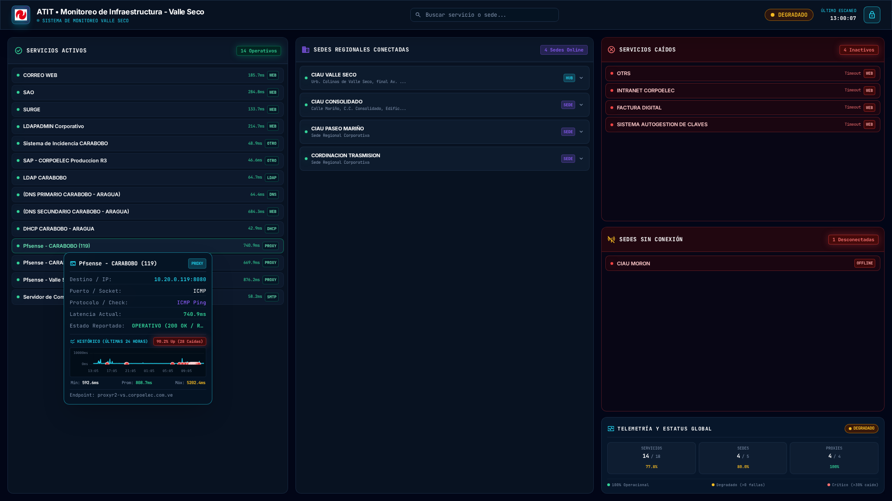
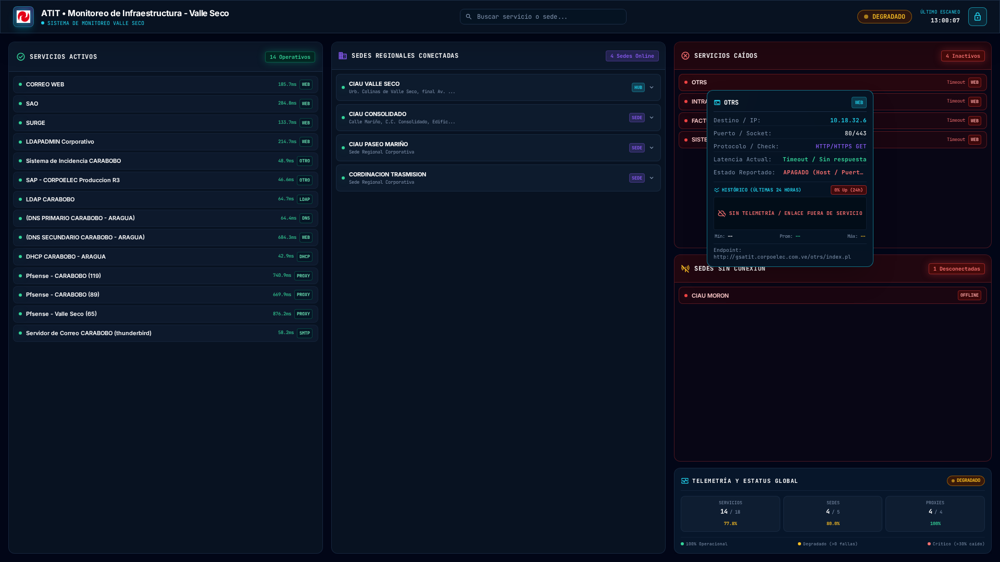
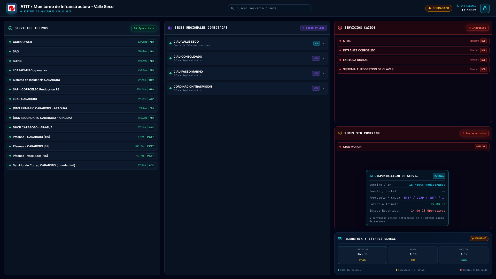

# 🛡️ Plataforma Integral de Monitoreo y Administración Valle Seco
### *Centro de Operaciones y Monitoreo de Infraestructura de Red*

[](https://www.python.org/)
[](https://laravel.com/)
[](https://mariadb.org/)
[](https://www.chartjs.org/)
[](https://httpd.apache.org/)
[](https://tailwindcss.com/)
[](LICENSE)

> **Organización:** Centro de Operaciones y Monitoreo de Redes  
> **Autor / Administrador:** José Brito ([@britojab](https://github.com/britojab) / [@britojq](https://github.com/britojq))  
> **Sistema Operativo Base:** Debian 12 / 13 GNU/Linux (amd64) o Ubuntu Server 22.04 / 24.04 LTS  
> **Acceso Portal Web:** `http://monitoreo-vs.local/`  

---

## 🌟 Visión General del Ecosistema

La **Plataforma Valle Seco** es una solución integral y unificada de telemetría de red, supervisión de aplicativos, administración remota del host físico y centinela de seguridad criptográfico, concebida para operar en entornos corporativos de alta demanda.

El ecosistema está integrado por cuatro componentes principales sincronizados:

```
                                  ┌────────────────────────────────────────────────────────┐
                                  │   🖥️ HOST FÍSICO / SERVIDOR LINUX (Debian / Ubuntu)   │
                                  └──────────────────────────┬─────────────────────────────┘
                                                             │
                  ┌───────────────────────────┬──────────────┴───────────────┬───────────────────────────┐
                  ▼                           ▼                              ▼                           ▼
       ┌─────────────────────┐     ┌─────────────────────┐        ┌─────────────────────┐     ┌─────────────────────┐
       │   🤖 Admin Bot      │     │  🛡️ Sentinel Bot    │        │  🌐 Portal Web      │     │  ⏰ Motor Cron/CLI  │
       │   tg-admin-bot      │     │  tg-sentinel-bot    │        │  Laravel + Apache   │     │  estatus web (5m)   │
       │  (Admin & IA Local) │     │ (DRM & Hardware ID) │        │ (monitoreo-vs.local)│     │  (monitor_web_sync) │
       └──────────┬──────────┘     └──────────┬──────────┘        └──────────┬──────────┘     └──────────┬──────────┘
                  │                           │                              │                           │
                  └───────────────────────────┴──────────────┬───────────────┴───────────────────────────┘
                                                             ▼
                                              ┌──────────────────────────────┐
                                              │  🗄️ Base de Datos MariaDB    │
                                              │  Database: monitoreo_vs      │
                                              │  User: monitoreo_user        │
                                              └──────────────────────────────┘
```

---

## 📸 Galería Visual del Portal Web (`http://monitoreo-vs.local/`)

### 1. Tablero General de Telemetría en Vivo
Supervisión unificada en tiempo real de 18 servicios críticos corporativos, 5 sedes regionales con sus equipos locales en sitio, proxies con conmutación en cascada y tarjetas ejecutivas de diagnóstico de salud de infraestructura:


### 2. HUD Interactivo con Histórico de 24 Horas (*Osciloscopio Sparkline*)
Al posar el cursor sobre cualquier servicio o sede, el visor técnico inteligente despliega la ficha de transporte y un micro-gráfico interactivo con la curva de latencias de las **últimas 24 horas** y **puntos rojos destacados en cada caída o pérdida de paquetes**:


### 3. Detección Inteligente de Incidentes y Múltiples Caídas
Si un servicio experimentó interrupciones o micro-cortes, el sistema resalta los momentos exactos de la caída con marcadores de alerta y calcula el porcentaje de disponibilidad real con el conteo de eventos (`90.2% Up (28 Caídas)`):



### 4. Modo Limpio para Servicios Fuera de Servicio
Si un servicio no posee enlace de comunicación (100% de pérdida de paquetes), el sistema oculta líneas falsas y presenta un estado nítido de advertencia técnica:



### 5. Ficha Ejecutiva Compacta en Métricas Globales
En los indicadores generales de resumen (Servicios, Sedes, Proxies), el visor presenta la información estadística ejecutiva de forma limpia y condensada:



---

## 🚀 Capacidades Destacadas del Sistema

### 1. 🌐 Portal Web de Operaciones (Laravel + Apache)
* **Monitoreo en Tiempo Real:** Refresco reactivo asíncrono cada 15 segundos sin parpadeos ni recargas de página.
* **Histórico Temporal de 24 Horas:** Gráficos *sparkline* estilizados con Chart.js protegidos en memoria (`window.SERVICE_HISTORIES` y `window.SITE_HISTORIES`), inmunes a sobreescrituras del DOM.
* **Panel Administrativo Completo (`/admin/services`):** Modales con gráficas extendidas de 6h, 24h, 7d y 30 días, bitácora cronológica de incidentes y gestión CRUD de servicios y sedes.

### 2. 🤖 Bot de Administración Telegram (`tg-admin-bot`)
* **Control del Servidor:** Comandos para reinicio físico de máquina (`/reboot`), diagnóstico de discos, memoria RAM y tarjetas de red (`enp0s31f6`).
* **Motor Local de IA:** Asistente conversacional corporativo basado en modelos locales privados, con conocimiento optimizado de la topología e infraestructura de red.
* **Conmutación Inteligente de Proxies (Failover):** Despacho automático directo y conmutación en cascada ante bloqueos de red hacia `DEFAULTPROXYA`, `DEFAULTPROXYB` y `DEFAULTPROXYC`.
* **Mantenimiento y Auditoría (`/limpiador`):** Detección interactiva de saturación de disco, limpieza de temporales y registro de intentos de acceso.

### 3. 🛡️ Bot Centinela de Seguridad (`tg-sentinel-bot`)
* **Licenciamiento y DRM por Hardware:** Vinculación criptográfica con el UUID de la placa base y el número de serie de la CPU del servidor anfitrión.
* **Token Criptográfico Embebido:** El bot Centinela opera de forma 100% autónoma; su token está blindado y auto-desofuscado internamente mediante hash SHA-256 en `monitor/core_shield.py`, eliminando la necesidad de configurarlo manualmente.

### 4. 🚨 Notificadores Nativos del Sistema Operativo
* **Alerta de Encendido / Recuperación Eléctrica (`boot-alert.service`):** Notificación inmediata a Telegram diferenciando entre un reinicio programado y una recuperación tras **falla eléctrica / corte forzado**.
* **Alerta de Intrusión SSH en Tiempo Real:** Gancho (*hook*) nativo en `/etc/pam.d/sshd` que envía a Telegram la IP, usuario, fecha y geolocalización de cada inicio de sesión SSH en el servidor.

---

## 🛠️ Guía de Instalación Maestro (Desatendida)

El instalador unificado (`installer/install.sh`) aprovisiona el sistema de **0 a 100** de forma completamente automatizada en un servidor limpio con Debian o Ubuntu Server.

### Paso 1: Clonar el Repositorio
Debido a que las rutas absolutas de los servicios `systemd`, los hooks PAM y las tareas cron están estandarizadas, clona el proyecto en `/scripts/telegram-admin-bot`:

```bash
# Crear directorio base y clonar repositorio
sudo mkdir -p /scripts
sudo git clone https://github.com/britojq/tgbot-pyt-bashfull.git /scripts/telegram-admin-bot
```

### Paso 2: Ejecutar el Instalador Maestro
Ejecuta el instalador con privilegios de superusuario (`sudo`):

```bash
sudo bash /scripts/telegram-admin-bot/installer/install.sh
```

> [!NOTE]
> **Cero Configuración Manual para el Centinela:**  
> No necesitas configurar tokens de Sentinel. El módulo de seguridad criptográfico (`monitor/core_shield.py`) auto-deriva e inicializa el Centinela de forma autónoma durante el arranque.

---

### ⚙️ ¿Qué realiza automáticamente el instalador?

El instalador ejecuta todas las tareas necesarias sin requerir intervención:
1. **Paquetes del Sistema:** Instala dependencias base (curl, git, apache2, mariadb-server, php8.2+ con extensiones PDO, MySQL, cURL, GD, XML, Mbstring).
2. **Entorno Python & Playwright:** Despliega el entorno virtual `/scripts/telegram-admin-bot/venv`, instala dependencias de `requirements.txt` y aprovisiona el motor Chromium headless.
3. **Base de Datos:** Crea la base de datos `monitoreo_vs`, genera el usuario `monitoreo_user` con clave de alta entropía e importa el esquema limpio con catálogos y usuarios precargados (`database/schema_monitoreo.sql`).
4. **Portal Web Laravel:** Sincroniza la aplicación en `/var/www/monitoreo`, configura el archivo `.env` de producción, genera la `APP_KEY`, ajusta permisos para `www-data` y activa el VirtualHost Apache en `http://monitoreo-vs.local/`.
5. **Comandos Globales:** Registra en `/usr/local/bin` las herramientas CLI `estatus`, `checkpoint` y `rollback`.
6. **Servicios Systemd:** Habilita y arranca los demonios `tg-admin-bot`, `tg-sentinel-bot`, el notificador `boot-alert.service` y el gancho PAM para alertas SSH.

---

## 💻 Herramientas CLI del Sistema

El sistema incorpora tres comandos globales de consola disponibles en el terminal:

### 1. `estatus` (Motor de Monitoreo)
```bash
# Sincronizar telemetría web con la base de datos (ejecutado por cron cada 5m)
estatus web

# Chequeo de Servicios Corporativos y reporte a Telegram
estatus servicios

# Chequeo de Sedes Regionales y Subestaciones
estatus sedes

# Chequeo Completo (Servicios + Sedes)
estatus completo

# Diagnóstico profundo de tráfico de red (.pcap + tshark)
estatus analisis_red

# Ejecutar escaneo localmente sin enviar mensaje a Telegram
estatus servicios --no-send
```

### 2. `checkpoint` (Puntos de Restauración)
Crea una copia de seguridad atómica del estado operativo del sistema y su base de datos:
```bash
checkpoint "Descripción del cambio o mantenimiento"
```

### 3. `rollback` (Restauración Rápida)
Revierte el sistema a un punto de control previo de forma segura:
```bash
# Listar checkpoints disponibles
rollback --list

# Revertir a un checkpoint específico
rollback 20260902_122152
```

---

## 📋 Comandos del Bot de Telegram

### 👑 Comandos de Administrador:
| Comando | Descripción |
| :--- | :--- |
| `/emergencia` | Menú de contingencia (detención segura, modo mantenimiento, restauración). |
| `/reboot` | Reinicio controlado del servidor anfitrión. |
| `/botstatus` | Latencia de conexión directa, estado de proxies y diagnóstico de socket. |
| `/permisos` | Panel interactivo para autorizar o revocar accesos de usuarios y grupos. |
| `/limpiador` | Diagnóstico de almacenamiento, inodos y depuración de espacio en disco. |
| `/migrar_token` | Asistente guiado para renovación y rotación del token del bot principal. |
| `/actualizar` | Comprobación y forzado de sincronización con el repositorio oficial Git. |

### 👥 Comandos de Telemetría y Operaciones:
| Comando | Descripción |
| :--- | :--- |
| `/servicios` | Estado de servicios corporativos (OTRS, Intranet, Factura Digital, Correo, etc.). |
| `/sedes` | Conectividad y latencia WAN de sedes físicas y routers corporativos. |
| `/monitoreo` | Ejecución concurrente del reporte completo de sedes y servicios. |
| `/analisis_red` | Análisis de tráfico LAN (.pcap), tormentas de broadcast y escaneo ARP. |
| `/reset_ia` | Reinicio de la memoria de contexto del asistente conversacional de IA. |
| `/info` | Información corporativa, términos de servicio y aviso de confidencialidad. |

---

## 📂 Estructura del Repositorio

```text
/scripts/telegram-admin-bot/
├── bot.py                            # Demonio del bot de administración Telegram
├── sentinel_bot.py                   # Demonio del bot Centinela de seguridad y DRM
├── estatus                           # Herramienta CLI de telemetría y monitoreo
├── checkpoint                        # Herramienta CLI para creación de puntos de restauración
├── rollback                          # Herramienta CLI para reversión de checkpoints
├── requirements.txt                  # Dependencias Python del sistema
├── installer/
│   └── install.sh                    # Instalador maestro unificado de 0 a 100
├── database/
│   └── schema_monitoreo.sql          # Volcado de estructura (17 tablas) y datos iniciales
├── web_portal/                       # Código fuente completo del Portal Web (Laravel 11)
│   ├── app/Http/Controllers/         # Controladores (PublicMonitoringController, etc.)
│   ├── resources/views/              # Vistas Blade (public/index, admin/services)
│   └── routes/web.php                # Rutas web y API de telemetría
├── monitor/
│   ├── core_shield.py                # Núcleo de blindaje criptográfico y DRM
│   ├── monitor_web_sync.py           # Motor de escaneo y sincronización con MariaDB
│   ├── boot_alert.py                 # Detector de arranque limpio vs falla eléctrica
│   ├── ssh_alert.py                  # Notificador en tiempo real de accesos SSH por PAM
│   ├── ssh_alert.sh                  # Wrapper de ejecución inmediata para PAM
│   ├── network_analyzer.py           # Análisis de paquetes (.pcap, tshark, arp-scan)
│   ├── monitor_engine.py             # Orquestador concurrente de red
│   └── telegram_dispatcher.py        # Despachador con conmutación en cascada de proxies
├── config/
│   ├── config.json                   # Configuración operativa del bot
│   ├── config.example.json           # Plantilla base de configuración
│   ├── bot.conf                      # Definición de proxies corporativos
│   ├── monitoreo.conf                # Definición de sedes, servicios y endpoints
│   └── mensajes.conf                 # Plantillas de formato HTML para Telegram
└── docs/
    ├── historial.txt                 # Bitácora detallada de intervenciones y cambios
    └── screenshots/                  # Capturas de pantalla oficiales del sistema
```

---

## 🔧 Gestión de Servicios del Sistema

| Acción | Comando |
| :--- | :--- |
| **Estado del Bot Principal** | `sudo systemctl status tg-admin-bot.service` |
| **Estado del Bot Centinela** | `sudo systemctl status tg-sentinel-bot.service` |
| **Estado de Alertas de Arranque** | `sudo systemctl status boot-alert.service` |
| **Logs en tiempo real (Bot)** | `sudo journalctl -u tg-admin-bot.service -f` |
| **Logs en tiempo real (Web Cron)**| `sudo tail -f /var/log/syslog | grep CRON` |
| **Reiniciar todos los demonios** | `sudo systemctl restart tg-admin-bot tg-sentinel-bot` |

---

## ⚖️ Licencia y Créditos

Desarrollado y mantenido por **José A. Brito H.** ([@britojab](https://github.com/britojab) / [@britojq](https://github.com/britojq)).  

Distribuido bajo la licencia **GNU Affero General Public License v3.0 (AGPLv3)**. Consulte el archivo `LICENSE` para más información.
