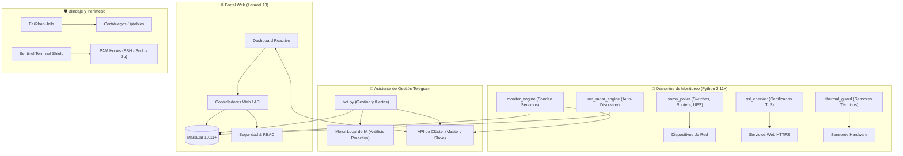

# 🛡️ Plataforma de Monitoreo y Administración de Red (Monitoreo Valle Seco)
### *Sistema Integral de Supervisión de Infraestructura Crítica, Telemetría y Continuidad Operativa*

[](https://www.python.org/)
[](https://laravel.com/)
[](https://mariadb.org/)
[](https://www.chartjs.org/)
[](https://js.cytoscape.org/)
[](https://httpd.apache.org/)
[](https://tailwindcss.com/)
[](LICENSE)

> **Trayectoria Institucional:** Proyecto Inicial: 2018 | Versión Enterprise Mejorada: 2018 - 2026 (`v3.0.0 Release`)  
> **Arquitectura Modular:** Módulos de la Plataforma: [1 / 5] Activo (Módulo Actual: Sistema de Monitoreo)  
> **Misión:** Módulo concebido y optimizado para supervisar la continuidad operativa e infraestructura crítica de la red corporativa.  
> **Autor / Administrador:** Operador ATIT ([@britojab](https://github.com/britojab) / [@britojq](https://github.com/britojq))  

---

## 🌟 Descripción General

Esta plataforma es una solución integral de supervisión tecnológica, telemetría de servicios de red, diagnóstico proactivo y administración remota concebida para entornos corporativos y de misión crítica.

El sistema unifica un portal web interactivo de alta reactividad en **Laravel 13**, demonios concurrentes de escaneo y telemetría en **Python 3.11+**, asistentes de gestión cifrada vía **Telegram**, un motor local de inteligencia artificial predictiva y soporte nativo para arquitecturas de clúster distribuido (**Master / Slave**).

---

## 🏗️ Arquitectura del Sistema



---

## 🚀 Capacidades y Módulos del Sistema

1. **Tablero de Control Web en Tiempo Real:** Visualización instantánea del estado de servicios corporativos, sedes remotas y proxies con refresco asíncrono y gráficas de disponibilidad continua (24h).
2. **Topología de Red Interactiva:** Renderizado de mapas de red mediante motor gráfico embebido 100% local (Cytoscape.js, sin dependencias de CDNs externas). Algoritmos de auto-distribución (COSE, Jerárquico, Concéntrico) e inspección de interfaces en tiempo real.
3. **Encendido Remoto Wake-on-LAN (WOL):** Despacho de paquetes *Magic Packet* para encendido de estaciones y servidores remotos desde la interfaz web o mediante comandos de Telegram (`/wol`).
4. **Motor de IA Predictiva y Análisis Proactivo:** Algoritmos estadísticos de regresión lineal ($y = mx + b$) y detección de anomalías por desvío estándar (>3σ) mediante el motor local de IA, anticipando saturación de almacenamiento, latencias anómalas o caídas de enlaces.
5. **Gestor de Ciclo de Vida de Hardware:** Supervisión de fechas de compra, vigencia de garantías (alerta verde >60d, amarilla ≤60d, roja vencida), obsolescencia (EOL/EOS) y salud SMART de discos duros.
6. **NET Radar y Descubrimiento Automático (Auto-Discovery):** Captura pasiva de tráfico, detección de equipos en red y clasificación automática de dispositivos autorizados frente a intrusos (*Rogue Devices*).
7. **Monitoreo de Infraestructura y Certificados SSL:** Verificación continua de puertos TCP/UDP, ICMP, agentes SNMP v2c/v3 y alerta temprana de expiración de certificados SSL/TLS con cálculo de días restantes.
8. **Blindaje de Seguridad y Contención:** Integración en PAM para notificación de accesos SSH, contención de sesiones `sudo` y `su / su -`, reglas perimetrales Fail2ban y Sentinel Terminal Shield.
9. **Guardián Térmico de Hardware:** Supervisión continua de sensores de temperatura de CPU con protocolo de contención y apagado seguro automático ante sobrecalentamiento crítico (≥75°C).
10. **Clúster de Alta Disponibilidad (Master / Slave):** Sincronización continua de telemetría e históricos mediante tokens criptográficos, con modo solo lectura garantizado en nodos esclavos para evitar saturación de firewalls.

---

## 📋 Requisitos del Sistema

- **Sistema Operativo:** Debian 12 / 13 GNU/Linux (amd64) o Ubuntu Server 22.04 / 24.04 LTS.
- **PHP:** Versión 8.2 o superior (extensiones: `pdo_mysql`, `curl`, `gd`, `xml`, `mbstring`, `ldap`).
- **Python:** Versión 3.11 o superior.
- **Base de Datos:** MariaDB 10.11+ o MySQL 8.0+.
- **Servidor Web:** Apache 2.4 o Nginx.

---

## 🛠️ Instalación y Pasarela de Onboarding Seguro

El sistema incluye un instalador unificado desatendido diseñado para llevar el servidor de 0 a 100 de forma completamente automatizada:

```bash
# 1. Clonar el repositorio oficial
git clone https://github.com/britojq/Monitoreo-VS.git /scripts/telegram-admin-bot

# 2. Acceder al directorio de trabajo
cd /scripts/telegram-admin-bot

# 3. Ejecutar el instalador maestro
sudo bash installer/install.sh
```

### 🛡️ Pasarela de Onboarding con Sentinel Bot (Cero Colisiones)

Para prevenir cualquier interferencia o conflicto de sesión (`Conflict: terminated by other getUpdates request`) con otros servidores en línea:

1. **Primer Arranque Seguro:** En toda instalación nueva, el instalador mantiene el bot principal desactivado e inicia temporalmente el demonio **Sentinel Bot** (`sentinel_bot.service`) con credenciales administrativas dedicadas.
2. **Notificación de Bienvenida:** Sentinel Bot envía una alerta automática al chat privado del Administrador con el Hostname, IPs detectadas y el Serial de Activación del hardware.
3. **Autorización y Aprovisionamiento:** El Administrador autoriza el servidor y asigna su propio token de Telegram mediante:
   - **Vía Telegram (Bot Centinela):**
     ```text
     /activar AUTH-XXXX-XXXX-XXXX-XXXX <NUEVO_TOKEN_BOT>
     ```
     *(o mediante el asistente guiado `/migrar`)*
   - **Vía Consola (Shell / SSH):**
     ```bash
     activar AUTH-XXXX-XXXX-XXXX-XXXX [TOKEN_BOT]
     ```
4. **Conmutación Automática:** Una vez validado, el hardware queda criptográficamente anclado, Sentinel Bot habilita y arranca el bot principal (`tg-admin-bot.service`) y se desactiva permanentemente para ceder el control operativo.

---

## 🔒 Blindaje del Sistema Operativo y Auditoría

La plataforma aplica políticas estrictas de seguridad sobre el servidor anfitrión:
- **Alertas y Contención PAM en Tiempo Real:**
  - SSH (`/etc/pam.d/sshd`): Notificación inmediata de conexión entrante a Telegram.
  - Sudo (`/etc/pam.d/sudo`): Auditoría obligatoria (`requisite seteuid stdout`).
  - Su (`/etc/pam.d/su`): Cobertura estricta para elevación de privilegios (`su`, `su -`, `su -l`).
- **Defensa Perimetral con Fail2ban:** Jails automatizadas contra fuerza bruta en SSH, Apache y escritorios remotos VNC.
- **Sentinel Terminal Shield:** Contención de terminales interactivas y auditoría de accesos.

---

## 💻 Herramientas de Línea de Comandos (CLI)

### 1. Herramienta `estatus`
```bash
# Diagnóstico completo de infraestructura y servicios
estatus completo

# Sincronización web y generación de snapshot
estatus web

# Telemetría de topología, WOL y análisis predictivo
estatus topologia
estatus wol --list
estatus predicciones --analyze
estatus inventario --summary

# Escaneo de red y detección de intrusos
estatus discovery --all
```

### 2. Herramienta `activar`
```bash
# Validación de hardware y asignación de token
activar AUTH-XXXX-XXXX-XXXX-XXXX 123456789:ABCdef...

# Consulta de estado y telemetría DRM del nodo
activar --estado
```

---

## 🤖 Catálogo de Comandos de Telegram

| Comando | Nivel | Descripción |
| :--- | :---: | :--- |
| `/servicios` | Operador | Estado consolidado y latencias de servicios monitoreados. |
| `/sedes` | Operador | Disponibilidad de enlaces y sedes remotas. |
| `/monitoreo` | Operador | Resumen ejecutivo del ecosistema de red. |
| `/recursos` | Operador | Métricas en tiempo real de CPU, memoria RAM y discos. |
| `/temperatura`| Operador | Lectura térmica de hardware y estado de protección. |
| `/topologia` | Operador | Resumen de enlaces de red y acceso al mapa visual. |
| `/wol` | Admin | Encendido remoto de equipos mediante Magic Packets. |
| `/predicciones`| Admin | Alertas de saturación detectadas por el motor local de IA. |
| `/inventario` | Admin | Estado de garantías de hardware, equipos EOL y SMART. |
| `/discovery` | Admin | Reporte de equipos en red y detección de intrusos. |
| `/botstatus` | Admin | Diagnóstico de conectividad de red y proxies. |
| `/reinicia` | Owner | Reinicio seguro del host físico (notificación privada exclusiva). |
| `/info` | Todos | Términos de servicio, versión activa e información general. |

---

## 🔌 API de Clúster (Master ↔ Slave)

La plataforma incluye una API nativa de sincronización distribuida para comunicación segura y sincronización continua de telemetría entre nodos del clúster (**Master / Slave**).

### Autenticación Criptográfica
Todas las solicitudes hacia los endpoints de clúster requieren el encabezado HTTP `X-Cluster-Token` con un token criptográfico generado desde el portal administrativo.

### Endpoints Principales

| Método | Endpoint | Descripción |
| :--- | :--- | :--- |
| `GET / POST` | `/api/cluster/ping` | Verificación de latencia y estado operativo del nodo. |
| `GET / POST` | `/api/cluster/telemetry` | Sincronización masiva de telemetría e históricos (soporte nativo de compresión gzip). |
| `GET / POST` | `/api/cluster/snapshot` | Extracción de instantánea consolidada del estado de supervisión. |
| `GET / POST` | `/api/cluster/diagnostics` | Diagnóstico integral de salud de hardware, servicios y bases de datos. |

#### Ejemplo de Consulta
```bash
curl -s -H "X-Cluster-Token: TU_TOKEN_DE_CLUSTER" \
     http://master.monitoreo-vs.local/api/cluster/ping
```

---

## ⚖️ Licencia y Créditos

Desarrollado y mantenido por **Operador ATIT** ([@britojab](https://github.com/britojab) / [@britojq](https://github.com/britojq)).  
Proyecto concebido en **2018** y perfeccionado de manera continua hasta su actual versión **2026**.

Distribuido bajo la licencia **GNU Affero General Public License v3.0 (AGPLv3)**. Consulte el archivo `LICENSE` para más información.
