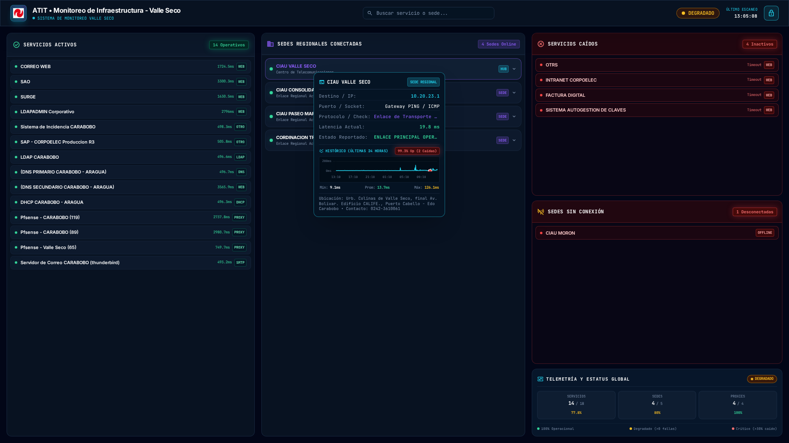
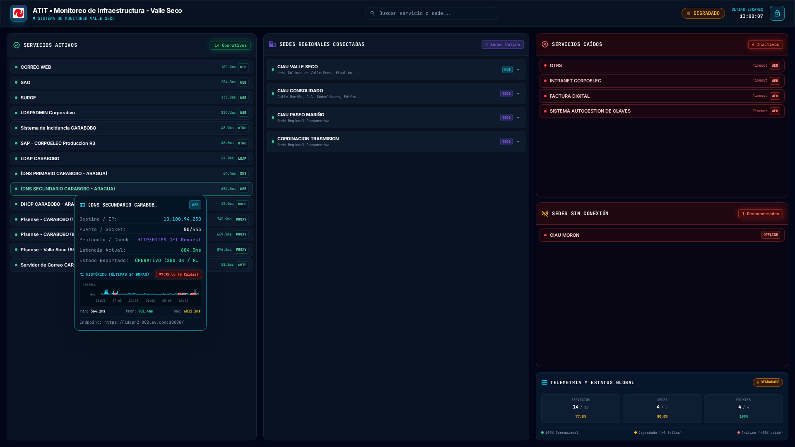

# 🛡️ Plataforma Integral de Monitoreo y Administración Valle Seco
### *Centro de Operaciones y Monitoreo de Infraestructura de Red*

[](https://www.python.org/)
[](https://laravel.com/)
[](https://mariadb.org/)
[](https://www.chartjs.org/)
[](https://httpd.apache.org/)
[](https://tailwindcss.com/)
[](LICENSE)

> **Organización:** Centro de Operaciones y Monitoreo de Redes  
> **Autor / Administrador:** José A. Brito H. ([@britojab](https://github.com/britojab) / [@britojq](https://github.com/britojq))  
> **Sistema Operativo Base:** Debian 12 / 13 GNU/Linux (amd64) o Ubuntu Server 22.04 / 24.04 LTS  
> **Topología de Servidores:** Servidor Principal Master (`10.20.23.252`) / Servidor Réplica Slave (`10.20.23.221`)  
> **Acceso Portal Web:** `http://monitoreo-vs.local/`  

---

## 🌟 Visión General del Ecosistema

La **Plataforma Valle Seco** es una solución de telemetría de red, supervisión de aplicativos corporativos, administración remota de host físico y blindaje de seguridad concebida para operar en entornos de misión crítica con alta demanda de disponibilidad.

El ecosistema integra de manera coordinada servicios web, bots de mensajería cifrada, demonios de seguridad, motores asíncronos en Python y un clúster distribuido de alta disponibilidad.

```
                              ┌────────────────────────────────────────────────────────┐
                              │     🖥️ INFRAESTRUCTURA DISTRIBUIDA VALLE SECO         │
                              └──────────────────────────┬─────────────────────────────┘
                                                         │
                ┌────────────────────────────────────────┴────────────────────────────────────────┐
                ▼                                                                                 ▼
   ┌──────────────────────────────┐                                                  ┌──────────────────────────────┐
   │    👑 NODO MASTER (252)       │                                                  │     🔗 NODO SLAVE (221)      │
   │  • Escaneo oficial de red    │                                                  │  • Réplica de sólo lectura   │
   │  • Consultas hacia pfSense   │ ─── Telemetría Snapshot / API Cifrada ────────▶  │  • Sin colisión en pfSense   │
   │  • Configuración mutable     │       [X-CLUSTER-TOKEN /api/cluster/*]           │  • Comandos independientes   │
   └──────────────┬───────────────┘                                                  └──────────────┬───────────────┘
                  │                                                                                 │
                  └──────────────────────────────────────┬──────────────────────────────────────────┘
                                                         │
       ┌───────────────────────────┬─────────────────────┴─────────────┬───────────────────────────┐
       ▼                           ▼                                   ▼                           ▼
┌─────────────────────┐ ┌─────────────────────┐             ┌─────────────────────┐     ┌─────────────────────┐
│   🤖 Admin Bot      │ │  🛡️ Sentinel Bot    │             │  🌐 Portal Web      │     │  🌡️ Thermal Guard   │
│   tg-admin-bot      │ │  tg-sentinel-bot    │             │  Laravel 11+ Apache │     │  tg-thermal-guard   │
│ (Admin & Motor IA)  │ │ (DRM & Hardware ID) │             │(monitoreo-vs.local) │     │ (Parada Segura 75°C)│
└──────────┬──────────┘ └──────────┬──────────┘             └──────────┬──────────┘     └──────────┬──────────┘
           │                       │                                   │                           │
           └───────────────────────┴─────────────────┬─────────────────┴───────────────────────────┘
                                                     ▼
                                      ┌──────────────────────────────┐
                                      │  🗄️ Base de Datos MariaDB    │
                                      │  Database: monitoreo_vs      │
                                      │  User: monitoreo_user        │
                                      └──────────────────────────────┘
```

---

## 🏛️ Arquitectura de Clúster de Alta Disponibilidad (Master / Slave)

Para garantizar la continuidad operativa y evitar problemas de colisión de credenciales o saturación en el firewall perimetral (**pfSense**), la plataforma implementa una arquitectura de clúster con roles diferenciados:

```
                      ┌───────────────────────────────────────────────────┐
                      │              SERVIDOR FIREWALL PFSENSE            │
                      └─────────────────────────┬─────────────────────────┘
                                                │ (Consultas y escaneos exclusivos)
                                                ▼
                                   ┌─────────────────────────┐
                                   │    👑 SERVIDOR MASTER   │
                                   │      (10.20.23.252)     │
                                   └────────────┬────────────┘
                                                │
                 Snapshot JSON vía API Cifrada  │ (X-CLUSTER-TOKEN)
                 Cadencia configurable (1-15m)  │ Latencia interna < 0.1s
                                                ▼
                                   ┌─────────────────────────┐
                                   │    🔗 SERVIDOR SLAVE    │
                                   │      (10.20.23.221)     │
                                   └─────────────────────────┘
```

### 1. Rol Master (Servidor Principal - `10.20.23.252`):
- **Escaneo Oficial de Infraestructura:** Es el único nodo autorizado para consultar directamente los estados de enlaces, proxies Squid y métricas de pfSense.
- **Autoridad de Configuración:** Las adiciones, ediciones o eliminaciones de servicios, sedes y proxies se ejecutan exclusivamente en este nodo y se persisten en `monitoreo.conf`.
- **Servidor de API de Clúster:** Expone el endpoint protegido `/api/cluster/snapshot`, que genera instantáneas completas de telemetría validadas criptográficamente mediante el encabezado `X-CLUSTER-TOKEN`.

### 2. Rol Slave (Servidor Réplica - `10.20.23.221`):
- **Cero Consultas Externas al Firewall:** No realiza escaneos directos a pfSense ni a la red WAN, eliminando riesgos de baneos o bloqueos por concurrencia de credenciales.
- **Sincronización Asíncrona Ultraligera:** El demonio `monitor_web_sync.py` descarga automáticamente el snapshot del Master en intervalos ajustables (**1, 2, 5, 10 o 15 minutos**) con latencia interna inferior a 100 ms.
- **Interfaz Adaptativa de Solo Lectura:** El portal web desactiva automáticamente los formularios de mutación de infraestructura, oculta botones de guardado a `.conf` y despliega avisos visuales explicativos.
- **Autonomía Operativa de Comandos:** Mantiene plena autonomía para responder comandos en Telegram (`/servicios`, `/sedes`, etc.) permitiendo a los administradores contar con dos perspectivas independientes del estado operativo.
- **Indicador HUD en TopBar:** Muestra el rol actual (**MAESTRO** o **ESCLAVO**) con tooltip informativo de estado de enlace, latencia y cadencia de actualización.

---

## 🔑 Directorio Activo (LDAP) & Autenticación Centralizada

La plataforma implementa un subsistema de autenticación híbrido (`LdapAuthService`) que combina la resiliencia de cuentas locales de administración con el inicio de sesión unificado corporativo:

```
                            ┌─────────────────────────────────┐
                            │    FORMULARIO DE INICIO WEB     │
                            └────────────────┬────────────────┘
                                             │
                       ¿Es cuenta local o correo administrativo?
                                      /              \
                                   (Sí)              (No / Usuario de Red)
                                    /                  \
                        ┌──────────────────┐     ┌────────────────────────┐
                        │ Autenticación en │     │  Consulta LDAP Server  │
                        │ MariaDB (Bcrypt) │     │     (10.20.0.22:389)   │
                        └──────────────────┘     └───────────┬────────────┘
                                                             │
                                                ¿Credenciales válidas en LDAP?
                                                             │ (Sí)
                                                ¿Área autorizada (ATIT) o Pre-autorizado?
                                                             │ (Sí)
                                                 Aprovisionamiento JIT (Operador/Admin)
```

### Características Técnicas del Módulo LDAP:
1. **Búsqueda Flexible Multi-Atributo:** El motor evalúa de forma inteligente UIDs (`A1746281`), números de cédula (`1746281`), códigos de empleado (`11746281`) y correos institucionales (`@corpoelec.gob.ve` / `@corpoelec.com.ve`).
2. **Control de Áreas Organizacionales:** Valida automáticamente la pertenencia a dependencias técnicas autorizadas (`ATIT, GPO TRAB INFRA TECNOL CARABOBO, INFRAESTRUCTURA, TELECOMUNICACIONES`).
3. **Aprovisionamiento Just-In-Time (JIT):** Los empleados autorizados que inician sesión por primera vez son registrados automáticamente en la base de datos local con el rol predeterminado configurado (`operator` o `admin`).
4. **Pre-autorización Manual en `/admin/users`:** Los administradores pueden buscar cuentas en el Directorio Activo mediante un modal interactivo en tiempo real (<20 ms) y concederles acceso manual con roles personalizados.
5. **Panel de Control Administrativo (En Vivo):**
   - **Interruptor Maestro (Habilitado / Deshabilitado):** Permite activar o desactivar la autenticación externa LDAP con un solo clic, restringiendo de forma segura el portal exclusivamente a cuentas locales en caso de mantenimiento de red.
   - **Parámetros Editables:** Host, puerto, Base DN y lista de áreas permitidas con persistencia atómica en `config/config.json`.
   - **Herramienta "Probar Conexión LDAP":** Ejecuta una prueba de socket y lectura de Base DN vía AJAX con retorno inmediato de latencia (ms) antes de aplicar cambios.

---

## 🖥️ Control Remoto en Navegador (Telnet & VNC)

El portal web incorpora clientes de acceso remoto directo desde la interfaz gráfica, sin requerir software cliente adicional en las estaciones de trabajo de los operadores:

### 1. Terminal Telnet Web (Xterm.js)
- **Acceso a Switches y Routers:** Integración con switches perimetrales (`SW01`, `SW02`, `SW03`) y routers principales (`10.20.23.1`, `10.20.23.119`, etc.).
- **Terminal Reactiva:** Emulación ANSI completa mediante Xterm.js con ajuste dinámico de dimensiones (*FitAddon*) y gestión de sesiones seguras.

### 2. Visor VNC Embebido
- **Supervisión de Estaciones Gráficas:** Visualización remota de interfaces de consolas de monitoreo locales (`10.20.23.66`).
- **Autenticación Temporal:** Generación de tokens de sesión con expiración para prevenir accesos concurrentes no autorizados.

---

## 🛡️ Centinela, Guardián Térmico y Seguridad Defensiva

### 1. Bot Centinela de Integridad (`tg-sentinel-bot`):
- **Licenciamiento y DRM Criptográfico:** Vinculación estricta con el identificador único del hardware anfitrión (UUID de la placa base y número de serie del procesador).
- **Auto-Derivación de Credenciales:** El token del bot centinela está embebido y protegido mediante hash SHA-256 en `monitor/core_shield.py`, ejecutándose como servicio independiente (`tg-sentinel-bot.service`).

### 2. Guardián Térmico y Protección de CPU (`tg-thermal-guard`):
- **Supervisión Continua a 5 Segundos:** Monitorea los sensores de temperatura del procesador (`k10temp` / `coretemp`).
- **Protección Física Escalonada:**
  - `65°C`: Estado de advertencia preventiva.
  - `70°C`: Alerta crítica con notificación de alta prioridad al Owner.
  - `75°C`: Parada segura de emergencia (`emergency_cooling`) para evitar daños permanentes en la electrónica del servidor.

### 3. Sistema Anti-Tampering y Módulo de Baneo (`/admin/bans`):
- **Detección de Manipulación No Autorizada:** Cualquier intento de un usuario de rol operador de invocar rutas o endpoints administrativos exclusivos provoca la suspensión inmediata de la cuenta y el bloqueo por IP del cliente.
- **Pantalla de Seguridad 403:** Interfaz personalizada que notifica el motivo de la suspensión y el código de incidente de auditoría.
- **Gestión de Desbaneo:** Panel administrativo para desbloquear direcciones IP o cuentas de usuario de forma selectiva o masiva.

### 4. Alertas Nativas del Sistema Operativo:
- **Alerta de Arranque Eléctrico (`boot-alert.service`):** Evalúa el estado del hardware al iniciar el sistema operativo para notificar al Administrador si el servidor arrancó tras un reinicio programado o tras un **corte de fluido eléctrico**.
- **Notificador de Intrusión SSH:** Gancho (*hook*) nativo en `/etc/pam.d/sshd` que despacha a Telegram la IP, usuario, hora y geolocalización de cada inicio de sesión por consola.

---

## 📸 Galería Visual del Portal Web (`http://monitoreo-vs.local/`)

### 1. Tablero General de Telemetría en Vivo
Supervisión unificada en tiempo real de servicios corporativos, sedes regionales conectadas, proxies con conmutación en cascada y tarjetas ejecutivas de salud del clúster:



### 2. HUD Interactivo con Histórico de 24 Horas (*Osciloscopio Sparkline*)
Al posar el cursor sobre cualquier servicio o sede, el visor técnico inteligente despliega la ficha de transporte y un micro-gráfico interactivo con la curva de latencias de las **últimas 24 horas** y marcadores destacados en cada pérdida de paquetes:



### 3. Tarjeta de Administración de Clúster (Master / Slave)
Gestión completa de roles, token criptográfico `X-CLUSTER-TOKEN`, cadencia de actualización y prueba de enlace API en vivo:


### 4. Directorio Activo & Autenticación LDAP
Panel para activar/desactivar el servicio LDAP, verificar latencia en tiempo real, configurar Base DN y gestionar roles JIT:


---

## 🛠️ Guía de Instalación Maestro (Desatendida)

El instalador unificado (`installer/install.sh`) aprovisiona el sistema de **0 a 100** de forma completamente automatizada en un servidor limpio con Debian o Ubuntu Server.

### Paso 1: Clonar el Repositorio
Debido a que las rutas absolutas de los servicios `systemd`, los hooks PAM y las tareas cron están estandarizadas, clona el proyecto en `/scripts/telegram-admin-bot`:

```bash
# Crear directorio base y clonar repositorio privado
sudo mkdir -p /scripts
sudo git clone https://github.com/britojq/tgbot-pyt-bashfull.git /scripts/telegram-admin-bot
```

### Paso 2: Ejecutar el Instalador Maestro
Ejecuta el instalador con privilegios de superusuario (`sudo`):

```bash
sudo bash /scripts/telegram-admin-bot/installer/install.sh
```

---

## ⚙️ Acciones Ejecutadas Automáticamente por el Instalador

1. **Paquetes del Sistema:** Instala dependencias base (curl, git, apache2, mariadb-server, php8.2+ con extensiones PDO, MySQL, cURL, GD, XML, Mbstring, LDAP).
2. **Entorno Python & Playwright:** Despliega el entorno virtual `/scripts/telegram-admin-bot/venv`, instala librerías de `requirements.txt` y aprovisiona el motor Chromium headless para pruebas de interfaz.
3. **Base de Datos MariaDB:** Crea la base de datos `monitoreo_vs`, genera el usuario `monitoreo_user` con clave de alta entropía e importa el esquema limpio con catálogos y usuarios precargados (`database/schema_monitoreo.sql`).
4. **Portal Web Laravel 11:** Sincroniza la aplicación en `/var/www/monitoreo`, configura el archivo `.env` de producción, genera la `APP_KEY`, ajusta permisos para `www-data` y activa el VirtualHost Apache en `http://monitoreo-vs.local/`.
5. **Comandos Globales:** Registra en `/usr/local/bin` las herramientas CLI `estatus`, `checkpoint` y `rollback`.
6. **Servicios Systemd:** Habilita y arranca los demonios `tg-admin-bot`, `tg-sentinel-bot`, `tg-thermal-guard`, el notificador `boot-alert.service` y el gancho PAM para alertas SSH.

---

## 💻 Herramientas CLI del Sistema

El sistema incorpora herramientas globales de consola disponibles en el terminal:

### 1. `estatus` (Motor de Monitoreo)
```bash
# Sincronizar telemetría web con la base de datos (ejecutado por cron)
estatus web

# Chequeo de Servicios Corporativos y reporte a Telegram
estatus servicios

# Chequeo de Sedes Regionales y Subestaciones
estatus sedes

# Chequeo Completo (Servicios + Sedes)
estatus completo

# Diagnóstico profundo de tráfico de red (.pcap + tshark)
estatus analisis_red

# Ejecutar escaneo localmente sin enviar mensaje a Telegram
estatus servicios --no-send
```

### 2. `checkpoint` (Puntos de Restauración Atómicos)
Crea una copia de seguridad atómica del estado operativo del sistema y su base de datos:
```bash
checkpoint "Descripción del cambio o mantenimiento"
```

### 3. `rollback` (Restauración Rápida)
Revierte el sistema a un punto de control previo de forma segura:
```bash
# Listar checkpoints disponibles
rollback --list

# Revertir a un checkpoint específico
rollback 20260902_122152
```

---

## 📋 Comandos del Bot de Telegram

### 👑 Comandos de Administrador (Owner: `38914901`):
| Comando | Descripción |
| :--- | :--- |
| `/emergencia` | Menú de contingencia (detención segura, modo mantenimiento, restauración). |
| `/reboot` | Reinicio controlado del servidor anfitrión. |
| `/botstatus` | Latencia de conexión directa, estado de proxies y diagnóstico de socket. |
| `/permisos` | Panel interactivo para autorizar o revocar accesos de usuarios y grupos. |
| `/limpiador` | Diagnóstico de almacenamiento, inodos y depuración de espacio en disco. |
| `/migrar_token` | Asistente guiado para renovación y rotación del token del bot principal. |
| `/actualizar` | Comprobación y forzado de sincronización con el repositorio oficial Git. |

### 👥 Comandos de Telemetría y Operaciones:
| Comando | Descripción |
| :--- | :--- |
| `/servicios` | Estado de servicios corporativos (OTRS, Intranet, Factura Digital, Correo, etc.). |
| `/sedes` | Conectividad y latencia WAN de sedes físicas y routers corporativos. |
| `/monitoreo` | Ejecución concurrente del reporte completo de sedes y servicios. |
| `/analisis_red` | Análisis de tráfico LAN (.pcap), tormentas de broadcast y escaneo ARP. |
| `/temperatura` | Lectura térmica de procesador y estado del guardián térmico. |
| `/recursos` | Uso de memoria RAM, CPU, espacio en disco y tiempo de actividad (*uptime*). |
| `/reset_ia` | Reinicio de la memoria de contexto del asistente conversacional con IA. |
| `/info` | Información institucional, términos de servicio y aviso de confidencialidad. |

---

## 📂 Estructura Exhaustiva del Repositorio

```text
/scripts/telegram-admin-bot/
├── bot.py                            # Demonio del bot de administración Telegram
├── sentinel_bot.py                   # Demonio del bot Centinela de seguridad y DRM
├── estatus                           # Herramienta CLI de telemetría y monitoreo
├── checkpoint                        # Herramienta CLI para creación de puntos de restauración
├── rollback                          # Herramienta CLI para reversión de checkpoints
├── requirements.txt                  # Dependencias Python del sistema
├── publicar_repositorio_publico.sh    # Script automatizado de exportación y sanitización a GitHub
├── installer/
│   └── install.sh                    # Instalador maestro unificado de 0 a 100
├── database/
│   └── schema_monitoreo.sql          # Volcado de estructura (17 tablas) y datos iniciales MariaDB
├── web_portal/                       # Código fuente completo del Portal Web (Laravel 11)
│   ├── app/
│   │   ├── Http/Controllers/Admin/   # Controladores administrativos (Cluster, LDAP, Bans, etc.)
│   │   ├── Models/                   # Modelos Eloquent (User, MonitoredService, etc.)
│   │   ├── Providers/                # View Composers y registros de servicios
│   │   └── Services/                 # Lógica de negocio (LdapAuthService, ClusterConfigService)
│   ├── resources/views/admin/        # Vistas Blade del panel de control
│   └── routes/web.php                # Rutas protegidas por RBAC y endpoints de API
├── monitor/
│   ├── core_shield.py                # Núcleo de blindaje criptográfico y DRM
│   ├── monitor_web_sync.py           # Motor de sincronización web (Master/Slave snapshot sync)
│   ├── thermal_guard.py              # Guardián térmico con parada segura de CPU a 75°C
│   ├── boot_alert.py                 # Detector de arranque limpio vs recuperación post-apagón
│   ├── ssh_alert.py                  # Notificador en tiempo real de accesos SSH por PAM
│   ├── ssh_alert.sh                  # Wrapper de ejecución inmediata para PAM
│   ├── network_analyzer.py           # Análisis de paquetes (.pcap, tshark, arp-scan)
│   ├── monitor_engine.py             # Orquestador concurrente de red y proxies
│   └── telegram_dispatcher.py        # Despachador con conmutación en cascada de proxies
├── config/
│   ├── config.json                   # Configuración operativa activa (Clúster, LDAP, Bot)
│   ├── config.example.json           # Plantilla base de configuración
│   ├── bot.conf                      # Definición de proxies corporativos
│   ├── monitoreo.conf                # Definición de sedes, servicios y endpoints
│   └── mensajes.conf                 # Plantillas de formato HTML para Telegram
└── docs/
    ├── historial.txt                 # Bitácora histórica detallada de intervenciones y cambios
    └── screenshots/                  # Capturas de pantalla oficiales del sistema
```

---

## 🔧 Gestión de Servicios del Sistema

| Acción | Comando |
| :--- | :--- |
| **Estado del Bot Principal** | `sudo systemctl status tg-admin-bot.service` |
| **Estado del Bot Centinela** | `sudo systemctl status tg-sentinel-bot.service` |
| **Estado del Guardián Térmico**| `sudo systemctl status tg-thermal-guard.service` |
| **Estado de Alertas de Arranque** | `sudo systemctl status boot-alert.service` |
| **Logs en tiempo real (Bot)** | `sudo journalctl -u tg-admin-bot.service -f` |
| **Logs en tiempo real (Web Cron)**| `sudo tail -f /var/log/syslog | grep CRON` |
| **Reiniciar todos los demonios** | `sudo systemctl restart tg-admin-bot tg-sentinel-bot tg-thermal-guard` |

---

## ⚖️ Licencia y Créditos

Desarrollado y mantenido por **José A. Brito H.** ([@britojab](https://github.com/britojab) / [@britojq](https://github.com/britojq)).  

Distribuido bajo la licencia **GNU Affero General Public License v3.0 (AGPLv3)**. Consulte el archivo `LICENSE` para más información.
